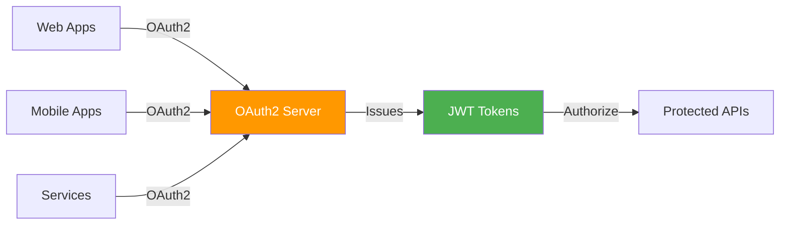
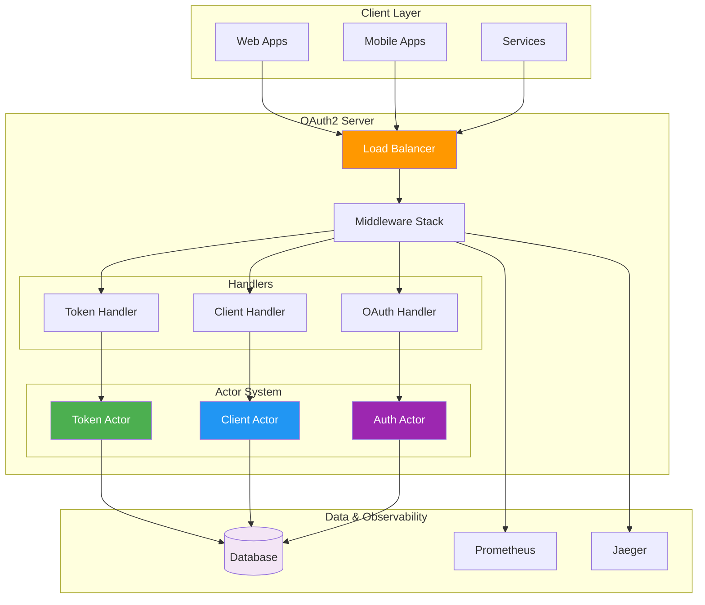

# Rust OAuth2 Server


A complete, production-ready OAuth2 authorization server built with Rust and Actix-web, featuring the actor model for concurrency, type safety, and comprehensive observability.

## 🌟 Overview

The Rust OAuth2 Server is a high-performance, secure, and scalable OAuth2 implementation designed for modern cloud-native applications. Built with Rust's safety guarantees and Actix's actor model, it provides enterprise-grade authentication and authorization services.



## 🚀 Features

### OAuth2 Compliance
- ✅ **Authorization Code Flow** with PKCE support
- ✅ **Client Credentials Flow** for service-to-service
- ✅ **Resource Owner Password Credentials Flow**
- ✅ **Refresh Token Flow** with rotation
- ✅ **Token Introspection** (RFC 7662)
- ✅ **Token Revocation** (RFC 7009)
- ✅ **Discovery Endpoint** (RFC 8414)

### Architecture
- 🎭 **Actor Model** using Actix for concurrent request handling
- 🔒 **Type-Safe** Rust implementation
- 🔐 **JWT Tokens** with configurable expiration
- 💾 **Database Support** (SQLite, PostgreSQL via SQLx)
- 🗄️ **Flyway Migrations** for database schema management

### Observability & Monitoring
- 📊 **Prometheus Metrics** - Request rates, token metrics, database performance
- 🔍 **OpenTelemetry Tracing** - Distributed tracing with OTLP export
- 📝 **Structured Logging** - JSON logs with correlation IDs
- ❤️ **Health & Readiness Checks** - Kubernetes-ready endpoints
- 📈 **Admin Dashboard** - Web-based monitoring and management

### Documentation
- 📚 **OpenAPI 3.0 Specification** - Auto-generated from code
- 🎨 **Swagger UI** - Interactive API documentation
- 📖 **Admin Control Panel** - Web-based administration interface

### Security
- 🔐 **PKCE Support** (Proof Key for Code Exchange)
- 🔑 **Secure Client Credentials** generation
- 🛡️ **Scope-based Authorization**
- 🚫 **Token Revocation**
- 🔐 **Social Login Integration** (Google, Microsoft, GitHub, Azure, Okta, Auth0)
- 🎫 **Session Management** with secure cookies
- ⚠️ **Rate Limiting** (planned)

## 📋 Prerequisites

- Rust 1.70 or higher
- SQLite or PostgreSQL
- Docker (optional, for containerized deployment)
- Flyway (optional, or use Docker for migrations)

## 🛠️ Installation

### Clone the Repository

```bash
git clone https://github.com/ianlintner/rust_oauth2.git
cd rust_oauth2
```

### Run Database Migrations

Using the provided script (uses Docker if Flyway not installed):

```bash
./scripts/migrate.sh
```

Or using Docker directly:

```bash
docker run --rm \
  -v "$(pwd)/migrations/sql:/flyway/sql" \
  -v "$(pwd)/flyway.conf:/flyway/conf/flyway.conf" \
  flyway/flyway:10-alpine migrate
```

### Build the Project

```bash
cargo build --release
```

## 🚀 Running the Server

### Development Mode

```bash
cargo run
```

### Production Mode

```bash
cargo run --release
```

### Using Docker Compose

```bash
docker-compose up -d
```

## 🔧 Configuration

Configuration can be set via environment variables with the `OAUTH2_` prefix:

### Basic Configuration

```bash
export OAUTH2_SERVER_HOST=127.0.0.1
export OAUTH2_SERVER_PORT=8080
export OAUTH2_DATABASE_URL=sqlite:oauth2.db
export OAUTH2_JWT_SECRET=your-secret-key-change-in-production
```

### Social Login Configuration

Configure social login providers by setting their respective environment variables:

#### Google OAuth2

```bash
export OAUTH2_GOOGLE_CLIENT_ID=your-google-client-id
export OAUTH2_GOOGLE_CLIENT_SECRET=your-google-client-secret
export OAUTH2_GOOGLE_REDIRECT_URI=http://localhost:8080/auth/callback/google
```

#### Microsoft/Azure AD

```bash
export OAUTH2_MICROSOFT_CLIENT_ID=your-microsoft-client-id
export OAUTH2_MICROSOFT_CLIENT_SECRET=your-microsoft-client-secret
export OAUTH2_MICROSOFT_REDIRECT_URI=http://localhost:8080/auth/callback/microsoft
export OAUTH2_MICROSOFT_TENANT_ID=common  # or your tenant ID
```

#### GitHub

```bash
export OAUTH2_GITHUB_CLIENT_ID=your-github-client-id
export OAUTH2_GITHUB_CLIENT_SECRET=your-github-client-secret
export OAUTH2_GITHUB_REDIRECT_URI=http://localhost:8080/auth/callback/github
```

#### Okta

```bash
export OAUTH2_OKTA_CLIENT_ID=your-okta-client-id
export OAUTH2_OKTA_CLIENT_SECRET=your-okta-client-secret
export OAUTH2_OKTA_REDIRECT_URI=http://localhost:8080/auth/callback/okta
export OAUTH2_OKTA_DOMAIN=your-okta-domain.okta.com
```

#### Auth0

```bash
export OAUTH2_AUTH0_CLIENT_ID=your-auth0-client-id
export OAUTH2_AUTH0_CLIENT_SECRET=your-auth0-client-secret
export OAUTH2_AUTH0_REDIRECT_URI=http://localhost:8080/auth/callback/auth0
export OAUTH2_AUTH0_DOMAIN=your-tenant.auth0.com
```

## 📍 Endpoints

### User Interface

- `GET /` - Redirects to login page
- `GET /auth/login` - Modern login page with social login options
- `GET /error` - Error page with detailed error information

### Social Login

- `GET /auth/login/google` - Initiate Google login
- `GET /auth/login/microsoft` - Initiate Microsoft/Azure AD login
- `GET /auth/login/github` - Initiate GitHub login
- `GET /auth/login/azure` - Initiate Azure AD login
- `GET /auth/login/okta` - Initiate Okta login
- `GET /auth/login/auth0` - Initiate Auth0 login
- `GET /auth/callback/{provider}` - OAuth callback handler
- `GET /auth/success` - Authentication success page
- `POST /auth/logout` - Logout endpoint

### OAuth2 Endpoints

- `GET /oauth/authorize` - Authorization endpoint
- `POST /oauth/token` - Token endpoint
- `POST /oauth/introspect` - Token introspection
- `POST /oauth/revoke` - Token revocation

### Client Management

- `POST /clients/register` - Register a new OAuth2 client

### Discovery

- `GET /.well-known/openid-configuration` - OAuth2 server metadata

### Admin & Monitoring

- `GET /admin` - Admin dashboard
- `GET /health` - Health check endpoint
- `GET /ready` - Readiness check endpoint
- `GET /metrics` - Prometheus metrics

### Documentation

- `GET /swagger-ui` - Interactive API documentation

## 📊 Metrics

The server exposes Prometheus metrics at `/metrics`:

- `oauth2_server_http_requests_total` - Total HTTP requests
- `oauth2_server_http_request_duration_seconds` - Request duration histogram
- `oauth2_server_oauth_token_issued_total` - Tokens issued counter
- `oauth2_server_oauth_token_revoked_total` - Tokens revoked counter
- `oauth2_server_oauth_clients_total` - Total registered clients
- `oauth2_server_oauth_active_tokens` - Active tokens gauge
- `oauth2_server_db_queries_total` - Database queries counter
- `oauth2_server_db_query_duration_seconds` - DB query duration histogram

## 🔍 OpenTelemetry

The server exports traces to an OTLP endpoint (default: `http://localhost:4317`). Configure your OpenTelemetry collector to receive traces.

Example with Jaeger:

```bash
docker run -d --name jaeger \
  -p 4317:4317 \
  -p 16686:16686 \
  jaegertracing/all-in-one:latest
```

Then access Jaeger UI at `http://localhost:16686`

## 🧪 Testing

### Run Unit Tests

```bash
cargo test
```

### Run Integration Tests

```bash
cargo test --test integration
```

### Run BDD Tests

```bash
cargo test --test bdd
```

## 📚 API Examples

### Register a Client

```bash
curl -X POST http://localhost:8080/clients/register \
  -H "Content-Type: application/json" \
  -d '{
    "client_name": "My Application",
    "redirect_uris": ["http://localhost:3000/callback"],
    "grant_types": ["authorization_code", "refresh_token"],
    "scope": "read write"
  }'
```

### Authorization Code Flow

1. **Get Authorization Code**:
```
http://localhost:8080/oauth/authorize?response_type=code&client_id=CLIENT_ID&redirect_uri=http://localhost:3000/callback&scope=read
```

2. **Exchange Code for Token**:
```bash
curl -X POST http://localhost:8080/oauth/token \
  -H "Content-Type: application/x-www-form-urlencoded" \
  -d "grant_type=authorization_code&code=AUTH_CODE&redirect_uri=http://localhost:3000/callback&client_id=CLIENT_ID&client_secret=CLIENT_SECRET"
```

### Client Credentials Flow

```bash
curl -X POST http://localhost:8080/oauth/token \
  -H "Content-Type: application/x-www-form-urlencoded" \
  -d "grant_type=client_credentials&client_id=CLIENT_ID&client_secret=CLIENT_SECRET&scope=read"
```

### Token Introspection

```bash
curl -X POST http://localhost:8080/oauth/introspect \
  -H "Content-Type: application/x-www-form-urlencoded" \
  -d "token=ACCESS_TOKEN"
```

## 🏗️ Architecture

The server uses the Actor model for concurrent, fault-tolerant request handling:



### Key Components

- **Actix-Web Server**: High-performance async HTTP server
- **Actor Model**: Isolated, concurrent request processing  
- **SQLx Database**: Compile-time verified queries
- **JWT Tokens**: Stateless authentication
- **Middleware Stack**: Metrics, tracing, CORS, authentication
- **OpenTelemetry**: Distributed tracing and observability

### OAuth2 Flows

```mermaid
graph LR
    subgraph "Authorization Code Flow"
        User1[User] -->|Login| Auth1[/oauth/authorize]
        Auth1 -->|Code| Client1[Client]
        Client1 -->|Exchange| Token1[/oauth/token]
        Token1 -->|Access Token| Client1
    end
    
    subgraph "Client Credentials Flow"
        Service[Service] -->|Credentials| Token2[/oauth/token]
        Token2 -->|Access Token| Service
    end
    
    style Auth1 fill:#4caf50,color:#fff
    style Token1 fill:#2196f3,color:#fff
    style Token2 fill:#2196f3,color:#fff
```

For detailed architecture documentation, see [Architecture Overview](docs/architecture/overview.md).

## 🤝 Contributing

Contributions are welcome! Please feel free to submit a Pull Request.

For development guidelines, see [Contributing Guide](docs/development/contributing.md).

## 📚 Documentation

Comprehensive documentation is available in the `/docs` directory:

- **[Getting Started](docs/getting-started/installation.md)** - Installation and quick start
- **[Configuration](docs/getting-started/configuration.md)** - Complete configuration guide
- **[Architecture](docs/architecture/overview.md)** - System design and components
- **[OAuth2 Flows](docs/flows/authorization-code.md)** - Detailed flow documentation
- **[API Reference](docs/api/endpoints.md)** - Endpoint documentation
- **[Deployment](docs/deployment/docker.md)** - Production deployment guides
- **[Observability](docs/observability/metrics.md)** - Monitoring and troubleshooting

## 📄 License

This project is licensed under either of:

- MIT License
- Apache License, Version 2.0

at your option.

## 🔗 Resources

- [OAuth 2.0 RFC 6749](https://tools.ietf.org/html/rfc6749)
- [PKCE RFC 7636](https://tools.ietf.org/html/rfc7636)
- [Token Introspection RFC 7662](https://tools.ietf.org/html/rfc7662)
- [Token Revocation RFC 7009](https://tools.ietf.org/html/rfc7009)
- [Actix Web Documentation](https://actix.rs/)
- [Keycloak](https://www.keycloak.org/) - Inspiration for feature set
