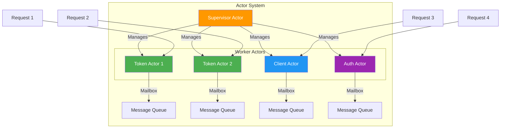
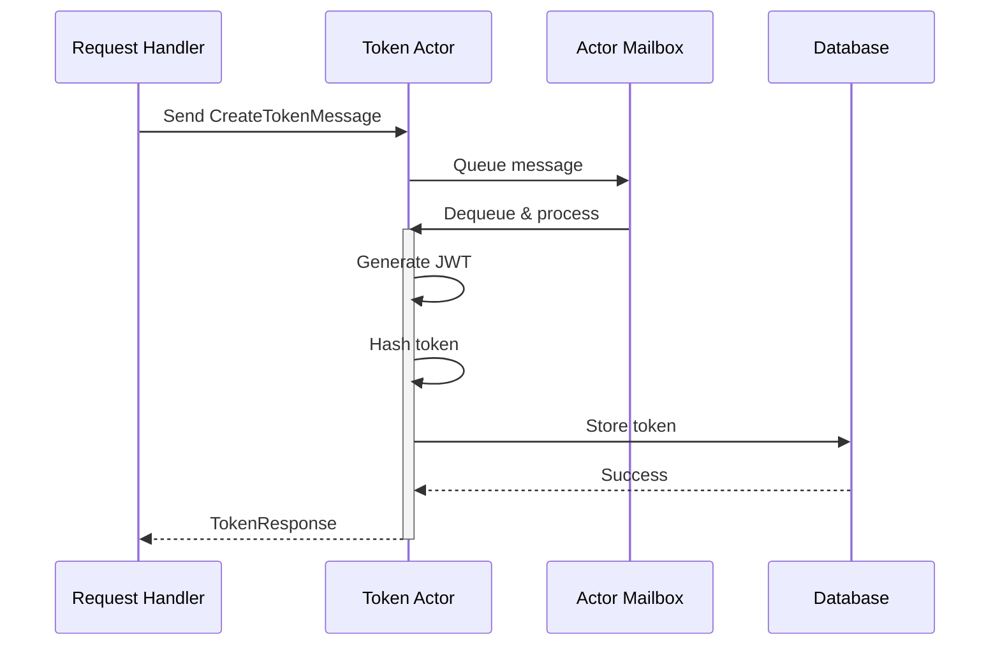
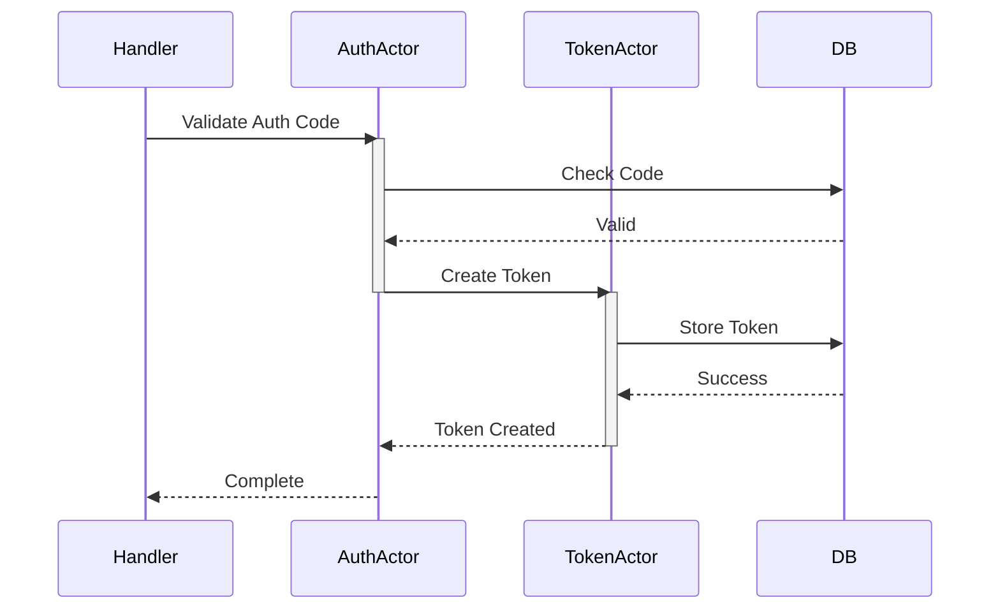
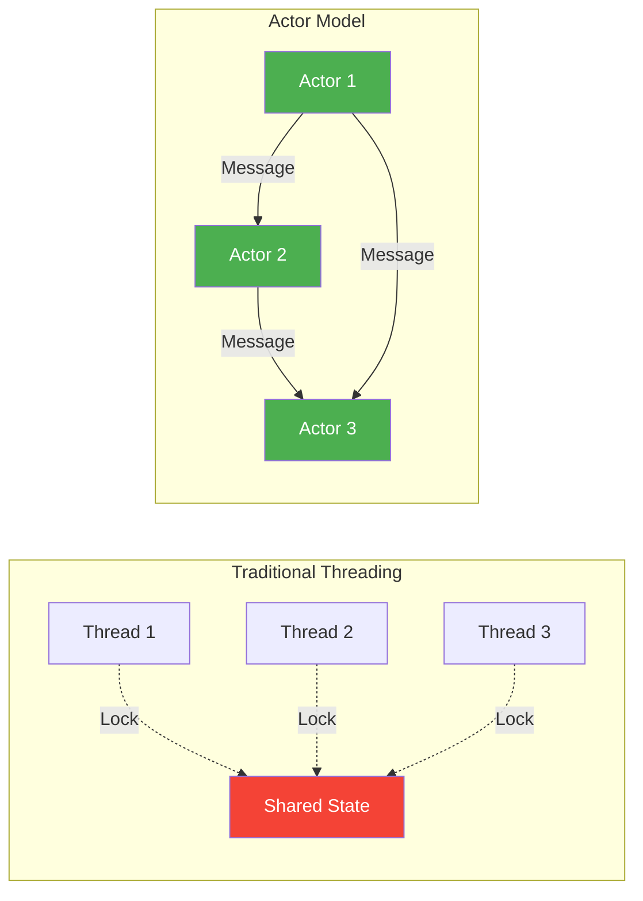
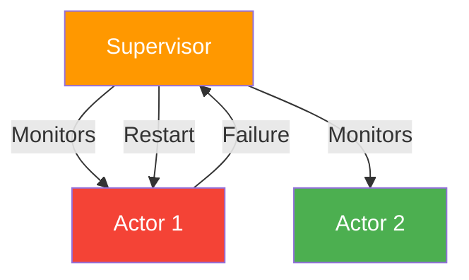

# Actor Model

The Rust OAuth2 Server uses the Actor Model for concurrent state management, leveraging the Actix framework for robust, scalable, and fault-tolerant request handling.

## What is the Actor Model?

The Actor Model is a mathematical model of concurrent computation that treats "actors" as the universal primitives of concurrent computation.

**Key Concepts:**

- **Actors**: Independent computational entities
- **Messages**: Actors communicate via message passing
- **Mailbox**: Each actor has a message queue
- **State Isolation**: No shared memory between actors
- **Asynchronous**: Non-blocking message processing



## Actor Architecture

### Actor Hierarchy

```mermaid
graph TD
    System[Actor System] --> TokenActor[Token Actor]
    System --> ClientActor[Client Actor]
    System --> AuthActor[Auth Actor]
    
    TokenActor --> CreateToken[Create Token Handler]
    TokenActor --> IntrospectToken[Introspect Token Handler]
    TokenActor --> RevokeToken[Revoke Token Handler]
    TokenActor --> RefreshToken[Refresh Token Handler]
    
    ClientActor --> RegisterClient[Register Client Handler]
    ClientActor --> GetClient[Get Client Handler]
    ClientActor --> UpdateClient[Update Client Handler]
    ClientActor --> DeleteClient[Delete Client Handler]
    
    AuthActor --> AuthorizeRequest[Authorize Request Handler]
    AuthActor --> ValidateAuthCode[Validate Auth Code Handler]
    AuthActor --> CreateAuthCode[Create Auth Code Handler]
    
    style System fill:#ff5722,color:#fff
    style TokenActor fill:#4caf50,color:#fff
    style ClientActor fill:#2196f3,color:#fff
    style AuthActor fill:#9c27b0,color:#fff
```



## Implemented Actors

### 1. Token Actor

Manages all token-related operations.

**Responsibilities:**

- Create access and refresh tokens
- Validate tokens
- Token introspection
- Token revocation
- Token expiration management

**Message Types:**

```rust
// Create new token
pub struct CreateTokenMessage {
    pub client_id: String,
    pub user_id: Option<String>,
    pub scope: String,
    pub grant_type: GrantType,
}

// Introspect token
pub struct IntrospectTokenMessage {
    pub token: String,
    pub client_id: String,
}

// Revoke token
pub struct RevokeTokenMessage {
    pub token: String,
    pub client_id: String,
}

// Refresh token
pub struct RefreshTokenMessage {
    pub refresh_token: String,
    pub client_id: String,
    pub scope: Option<String>,
}
```

**Actor Implementation:**

```rust
pub struct TokenActor {
    db: Arc<Database>,
    jwt_secret: String,
    access_token_expiration: i64,
    refresh_token_expiration: i64,
}

impl Actor for TokenActor {
    type Context = Context<Self>;
    
    fn started(&mut self, _ctx: &mut Self::Context) {
        tracing::info!("TokenActor started");
    }
}

// Message handling
impl Handler<CreateTokenMessage> for TokenActor {
    type Result = ResponseFuture<Result<TokenResponse, OAuth2Error>>;
    
    fn handle(&mut self, msg: CreateTokenMessage, _ctx: &mut Self::Context) -> Self::Result {
        let db = self.db.clone();
        let jwt_secret = self.jwt_secret.clone();
        let expiration = self.access_token_expiration;
        
        Box::pin(async move {
            // Create token logic
            let token = create_jwt_token(/* ... */)?;
            
            // Store in database
            db.store_token(token).await?;
            
            Ok(TokenResponse { /* ... */ })
        })
    }
}
```

**Message Flow:**



### 2. Client Actor

Manages OAuth2 client registrations and operations.

**Responsibilities:**

- Register new clients
- Validate client credentials
- Update client information
- Delete clients
- Client lookup operations

**Message Types:**

```rust
// Register new client
pub struct RegisterClientMessage {
    pub client_name: String,
    pub redirect_uris: Vec<String>,
    pub grant_types: Vec<GrantType>,
    pub scope: String,
}

// Get client
pub struct GetClientMessage {
    pub client_id: String,
}

// Validate client credentials
pub struct ValidateClientMessage {
    pub client_id: String,
    pub client_secret: String,
}

// Update client
pub struct UpdateClientMessage {
    pub client_id: String,
    pub updates: ClientUpdates,
}
```

**Actor Implementation:**

```rust
pub struct ClientActor {
    db: Arc<Database>,
}

impl Actor for ClientActor {
    type Context = Context<Self>;
}

impl Handler<RegisterClientMessage> for ClientActor {
    type Result = ResponseFuture<Result<ClientCredentials, OAuth2Error>>;
    
    fn handle(&mut self, msg: RegisterClientMessage, _ctx: &mut Self::Context) -> Self::Result {
        let db = self.db.clone();
        
        Box::pin(async move {
            // Generate client credentials
            let client_id = generate_client_id();
            let client_secret = generate_client_secret();
            
            // Store client
            db.create_client(/* ... */).await?;
            
            Ok(ClientCredentials { /* ... */ })
        })
    }
}
```

### 3. Auth Actor

Handles authorization requests and code management.

**Responsibilities:**

- Validate authorization requests
- Create authorization codes
- Validate and consume authorization codes
- PKCE challenge validation
- Redirect URI validation

**Message Types:**

```rust
// Validate authorization request
pub struct ValidateAuthRequestMessage {
    pub client_id: String,
    pub redirect_uri: String,
    pub scope: String,
    pub response_type: String,
    pub code_challenge: Option<String>,
    pub code_challenge_method: Option<String>,
}

// Create authorization code
pub struct CreateAuthCodeMessage {
    pub client_id: String,
    pub user_id: String,
    pub redirect_uri: String,
    pub scope: String,
    pub code_challenge: Option<String>,
    pub code_challenge_method: Option<String>,
}

// Validate authorization code
pub struct ValidateAuthCodeMessage {
    pub code: String,
    pub client_id: String,
    pub redirect_uri: String,
    pub code_verifier: Option<String>,
}
```

**Actor Implementation:**

```rust
pub struct AuthActor {
    db: Arc<Database>,
    code_expiration: i64,
}

impl Actor for AuthActor {
    type Context = Context<Self>;
}

impl Handler<CreateAuthCodeMessage> for AuthActor {
    type Result = ResponseFuture<Result<String, OAuth2Error>>;
    
    fn handle(&mut self, msg: CreateAuthCodeMessage, _ctx: &mut Self::Context) -> Self::Result {
        let db = self.db.clone();
        let expiration = self.code_expiration;
        
        Box::pin(async move {
            // Generate authorization code
            let code = generate_auth_code();
            
            // Store in database
            db.create_auth_code(/* ... */).await?;
            
            Ok(code)
        })
    }
}
```

## Actor Communication Patterns

### 1. Request-Response Pattern

Most common pattern for synchronous operations:

```mermaid
sequenceDiagram
    participant Client
    participant Handler
    participant Actor
    participant DB
    
    Client->>Handler: HTTP Request
    Handler->>Actor: Send Message
    activate Actor
    Actor->>DB: Database Operation
    DB-->>Actor: Result
    Actor-->>Handler: Response
    deactivate Actor
    Handler->>Client: HTTP Response
```

**Implementation:**

```rust
// Handler sends message and waits for response
let result = token_actor
    .send(CreateTokenMessage { /* ... */ })
    .await?  // Wait for actor to process
    ?;       // Handle actor result
```

### 2. Fire-and-Forget Pattern

For asynchronous operations that don't need immediate response:

```mermaid
sequenceDiagram
    participant Client
    participant Handler
    participant Actor
    
    Client->>Handler: HTTP Request
    Handler->>Actor: Do(Message)
    Handler->>Client: HTTP Response (Accepted)
    
    Note over Actor: Process later
    Actor->>Actor: Execute Task
```

**Implementation:**

```rust
// Handler sends message without waiting
token_actor.do_send(LogEventMessage { /* ... */ });
```

### 3. Actor-to-Actor Communication

Actors can communicate with each other:



## Concurrency Benefits

### 1. Isolation

Each actor maintains its own state independently:

```rust
// Each actor has isolated state
pub struct TokenActor {
    db: Arc<Database>,
    jwt_secret: String,
    metrics: TokenMetrics,  // Only this actor accesses these metrics
}
```

### 2. No Shared Mutable State

Actors communicate only through messages, eliminating data races:



### 3. Automatic Load Distribution

Multiple actor instances can process messages concurrently:

```rust
// Create multiple actor instances
for _ in 0..num_workers {
    let actor = TokenActor::new(/* ... */).start();
    actors.push(actor);
}

// Messages distributed across actors
let actor_idx = request_id % actors.len();
actors[actor_idx].send(message).await?;
```

## Error Handling

### Supervision and Recovery

Actors can be supervised and automatically restarted on failure:



**Implementation:**

```rust
impl Supervised for TokenActor {}

impl SystemService for TokenActor {
    fn service_started(&mut self, ctx: &mut Context<Self>) {
        tracing::info!("TokenActor service started");
    }
}
```

### Graceful Degradation

If one actor fails, others continue processing:

```rust
impl Handler<CreateTokenMessage> for TokenActor {
    fn handle(&mut self, msg: CreateTokenMessage, ctx: &mut Self::Context) -> Self::Result {
        Box::pin(async move {
            match create_token_internal(msg).await {
                Ok(token) => Ok(token),
                Err(e) => {
                    tracing::error!("Token creation failed: {}", e);
                    // Actor continues running for next messages
                    Err(OAuth2Error::ServerError)
                }
            }
        })
    }
}
```

## Performance Optimizations

### 1. Message Batching

Batch multiple operations for efficiency:

```rust
pub struct BatchCreateTokenMessage {
    pub requests: Vec<CreateTokenMessage>,
}

impl Handler<BatchCreateTokenMessage> for TokenActor {
    fn handle(&mut self, msg: BatchCreateTokenMessage, _ctx: &mut Self::Context) -> Self::Result {
        Box::pin(async move {
            let tokens = futures::future::join_all(
                msg.requests.into_iter().map(|req| create_token(req))
            ).await;
            
            Ok(tokens)
        })
    }
}
```

### 2. Actor Pooling

Create pools of actors for high-throughput operations:

```rust
pub struct TokenActorPool {
    actors: Vec<Addr<TokenActor>>,
    round_robin_index: AtomicUsize,
}

impl TokenActorPool {
    pub fn get_actor(&self) -> &Addr<TokenActor> {
        let index = self.round_robin_index.fetch_add(1, Ordering::Relaxed);
        &self.actors[index % self.actors.len()]
    }
}
```

### 3. Async Message Processing

All message handlers are async, preventing blocking:

```rust
impl Handler<DatabaseQueryMessage> for TokenActor {
    type Result = ResponseFuture<Result<QueryResult, Error>>;
    
    fn handle(&mut self, msg: DatabaseQueryMessage, _: &mut Self::Context) -> Self::Result {
        let db = self.db.clone();
        
        // Async execution doesn't block the actor
        Box::pin(async move {
            db.query(msg.sql).await
        })
    }
}
```

## Testing Actors

### Unit Testing

```rust
#[actix_rt::test]
async fn test_create_token() {
    let actor = TokenActor::new(/* ... */).start();
    
    let msg = CreateTokenMessage {
        client_id: "test_client".to_string(),
        user_id: Some("test_user".to_string()),
        scope: "read write".to_string(),
        grant_type: GrantType::ClientCredentials,
    };
    
    let result = actor.send(msg).await.unwrap();
    
    assert!(result.is_ok());
    let token = result.unwrap();
    assert!(!token.access_token.is_empty());
}
```

### Integration Testing

```rust
#[actix_rt::test]
async fn test_auth_flow_with_actors() {
    let system = System::new();
    
    let auth_actor = AuthActor::new(/* ... */).start();
    let token_actor = TokenActor::new(/* ... */).start();
    
    // Create auth code
    let code = auth_actor
        .send(CreateAuthCodeMessage { /* ... */ })
        .await
        .unwrap()
        .unwrap();
    
    // Exchange for token
    let token = token_actor
        .send(ExchangeCodeMessage { code, /* ... */ })
        .await
        .unwrap()
        .unwrap();
    
    assert!(!token.access_token.is_empty());
}
```

## Best Practices

### 1. Keep Actors Focused

Each actor should have a single, well-defined responsibility:

✅ **Good**: Separate actors for tokens, clients, and authorization
❌ **Bad**: One actor handling all OAuth2 operations

### 2. Avoid Blocking Operations

Never block an actor's message handler:

```rust
// ❌ Bad: Blocking operation
impl Handler<Message> for MyActor {
    fn handle(&mut self, _msg: Message, _ctx: &mut Self::Context) -> Self::Result {
        std::thread::sleep(Duration::from_secs(1));  // Blocks!
        Ok(())
    }
}

// ✅ Good: Async operation
impl Handler<Message> for MyActor {
    type Result = ResponseFuture<Result<(), Error>>;
    
    fn handle(&mut self, _msg: Message, _ctx: &mut Self::Context) -> Self::Result {
        Box::pin(async move {
            tokio::time::sleep(Duration::from_secs(1)).await;
            Ok(())
        })
    }
}
```

### 3. Handle All Error Cases

Always handle potential errors in message handlers:

```rust
impl Handler<CreateTokenMessage> for TokenActor {
    fn handle(&mut self, msg: CreateTokenMessage, _: &mut Self::Context) -> Self::Result {
        Box::pin(async move {
            // Validate input
            if msg.client_id.is_empty() {
                return Err(OAuth2Error::InvalidClient);
            }
            
            // Handle database errors
            let result = db.create_token(/* ... */).await;
            match result {
                Ok(token) => Ok(token),
                Err(DbError::Duplicate) => Err(OAuth2Error::InvalidGrant),
                Err(e) => {
                    tracing::error!("Database error: {}", e);
                    Err(OAuth2Error::ServerError)
                }
            }
        })
    }
}
```

### 4. Use Typed Messages

Define clear message types instead of generic structures:

```rust
// ✅ Good: Specific message types
pub struct CreateTokenMessage { /* ... */ }
pub struct RevokeTokenMessage { /* ... */ }

// ❌ Bad: Generic message
pub struct ActorMessage {
    action: String,
    data: serde_json::Value,
}
```

## Monitoring Actor Performance

Track actor performance with metrics:

```rust
impl Handler<CreateTokenMessage> for TokenActor {
    fn handle(&mut self, msg: CreateTokenMessage, _: &mut Self::Context) -> Self::Result {
        let start = std::time::Instant::now();
        
        Box::pin(async move {
            let result = create_token_internal(msg).await;
            
            // Record metrics
            let duration = start.elapsed();
            TOKEN_ACTOR_DURATION.observe(duration.as_secs_f64());
            
            if result.is_ok() {
                TOKEN_ACTOR_SUCCESS.inc();
            } else {
                TOKEN_ACTOR_ERRORS.inc();
            }
            
            result
        })
    }
}
```

## Next Steps

- [Database Architecture](database.md) - Database schema and operations
- [API Endpoints](../api/endpoints.md) - HTTP endpoints using actors
- [Performance Tuning](../deployment/production.md#performance) - Optimize actor performance
