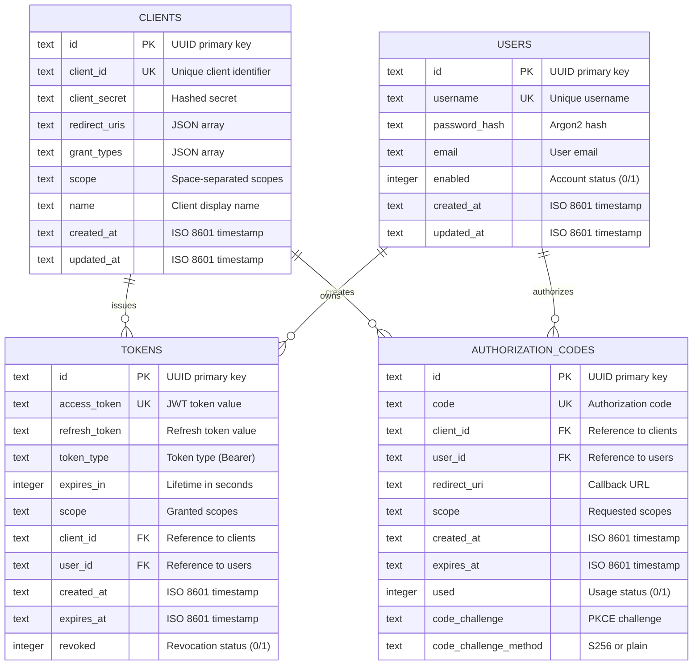
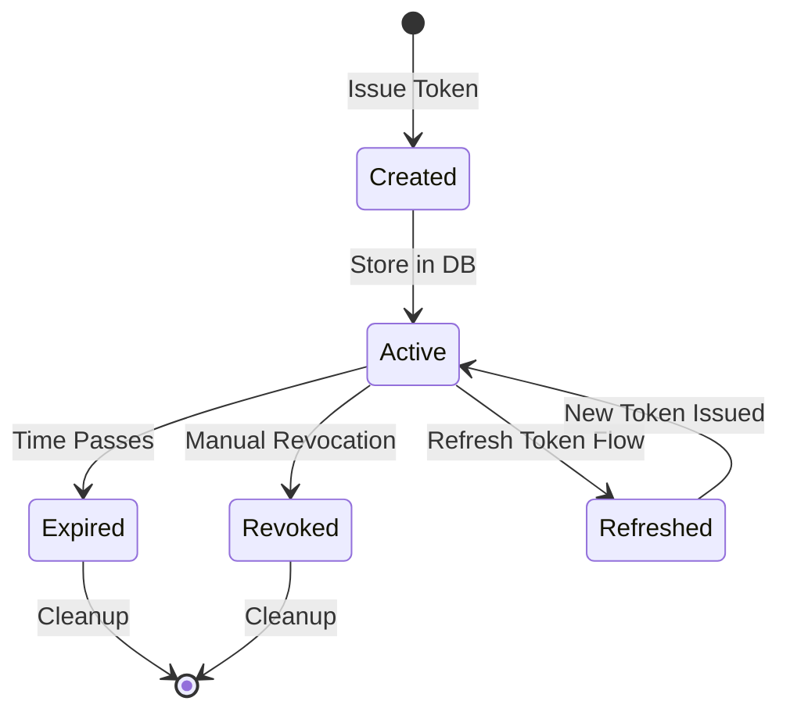
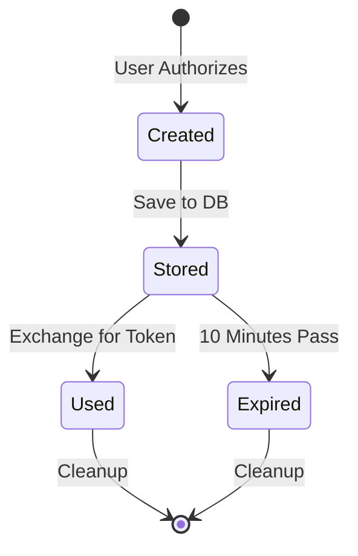

# Database Architecture

This document provides comprehensive documentation of the database schema, migrations, and data access patterns used in the Rust OAuth2 Server.

## Database Overview

The server supports two database backends:

- **SQLite**: For development and testing
- **PostgreSQL**: For production deployments

### Technology: SQLx

The server uses **SQLx**, a Rust SQL toolkit featuring:

- **Compile-time verification**: SQL queries checked at compile time
- **Async/await support**: Non-blocking database operations
- **Connection pooling**: Efficient resource management
- **Type safety**: Database types mapped to Rust types
- **Migration support**: Built-in migration management

## Database Schema

### Entity Relationship Diagram



## Table Definitions

### 1. Clients Table

Stores OAuth2 client registrations.

```sql
CREATE TABLE IF NOT EXISTS clients (
    id TEXT PRIMARY KEY,
    client_id TEXT NOT NULL UNIQUE,
    client_secret TEXT NOT NULL,
    redirect_uris TEXT NOT NULL,
    grant_types TEXT NOT NULL,
    scope TEXT NOT NULL,
    name TEXT NOT NULL,
    created_at TEXT NOT NULL,
    updated_at TEXT NOT NULL
);

CREATE INDEX idx_clients_client_id ON clients(client_id);
```

**Fields:**

| Field | Type | Description |
|-------|------|-------------|
| `id` | TEXT (UUID) | Primary key, internal identifier |
| `client_id` | TEXT | Public client identifier (unique) |
| `client_secret` | TEXT | Hashed client secret for authentication |
| `redirect_uris` | TEXT (JSON) | Allowed redirect URIs as JSON array |
| `grant_types` | TEXT (JSON) | Supported grant types as JSON array |
| `scope` | TEXT | Space-separated list of allowed scopes |
| `name` | TEXT | Human-readable client name |
| `created_at` | TEXT (ISO 8601) | Creation timestamp |
| `updated_at` | TEXT (ISO 8601) | Last update timestamp |

**Example Data:**

```json
{
  "id": "123e4567-e89b-12d3-a456-426614174000",
  "client_id": "web_app_client_abc123",
  "client_secret": "$argon2id$v=19$m=19456,t=2,p=1$...",
  "redirect_uris": "[\"https://app.example.com/callback\",\"https://app.example.com/silent-renew\"]",
  "grant_types": "[\"authorization_code\",\"refresh_token\"]",
  "scope": "read write profile",
  "name": "Example Web Application",
  "created_at": "2024-01-01T00:00:00Z",
  "updated_at": "2024-01-01T00:00:00Z"
}
```

### 2. Users Table

Stores user accounts for authentication.

```sql
CREATE TABLE IF NOT EXISTS users (
    id TEXT PRIMARY KEY,
    username TEXT NOT NULL UNIQUE,
    password_hash TEXT NOT NULL,
    email TEXT NOT NULL,
    enabled INTEGER NOT NULL DEFAULT 1,
    created_at TEXT NOT NULL,
    updated_at TEXT NOT NULL
);

CREATE INDEX idx_users_username ON users(username);
CREATE INDEX idx_users_email ON users(email);
```

**Fields:**

| Field | Type | Description |
|-------|------|-------------|
| `id` | TEXT (UUID) | Primary key, internal identifier |
| `username` | TEXT | Unique username for login |
| `password_hash` | TEXT | Argon2id password hash |
| `email` | TEXT | User email address |
| `enabled` | INTEGER | Account status (1=enabled, 0=disabled) |
| `created_at` | TEXT (ISO 8601) | Account creation timestamp |
| `updated_at` | TEXT (ISO 8601) | Last update timestamp |

**Example Data:**

```json
{
  "id": "987fcdeb-51a2-43f7-9c8d-7b6e5a4f3c2b",
  "username": "john.doe",
  "password_hash": "$argon2id$v=19$m=19456,t=2,p=1$...",
  "email": "john.doe@example.com",
  "enabled": 1,
  "created_at": "2024-01-01T00:00:00Z",
  "updated_at": "2024-01-01T00:00:00Z"
}
```

### 3. Tokens Table

Stores issued access and refresh tokens.

```sql
CREATE TABLE IF NOT EXISTS tokens (
    id TEXT PRIMARY KEY,
    access_token TEXT NOT NULL UNIQUE,
    refresh_token TEXT,
    token_type TEXT NOT NULL,
    expires_in INTEGER NOT NULL,
    scope TEXT NOT NULL,
    client_id TEXT NOT NULL,
    user_id TEXT NOT NULL,
    created_at TEXT NOT NULL,
    expires_at TEXT NOT NULL,
    revoked INTEGER NOT NULL DEFAULT 0,
    FOREIGN KEY (client_id) REFERENCES clients(client_id),
    FOREIGN KEY (user_id) REFERENCES users(id)
);

CREATE INDEX idx_tokens_access_token ON tokens(access_token);
CREATE INDEX idx_tokens_refresh_token ON tokens(refresh_token);
CREATE INDEX idx_tokens_client_id ON tokens(client_id);
CREATE INDEX idx_tokens_user_id ON tokens(user_id);
```

**Fields:**

| Field | Type | Description |
|-------|------|-------------|
| `id` | TEXT (UUID) | Primary key, internal identifier |
| `access_token` | TEXT | JWT access token (unique) |
| `refresh_token` | TEXT | Refresh token value (nullable) |
| `token_type` | TEXT | Token type (usually "Bearer") |
| `expires_in` | INTEGER | Token lifetime in seconds |
| `scope` | TEXT | Space-separated granted scopes |
| `client_id` | TEXT | Foreign key to clients table |
| `user_id` | TEXT | Foreign key to users table |
| `created_at` | TEXT (ISO 8601) | Token creation timestamp |
| `expires_at` | TEXT (ISO 8601) | Token expiration timestamp |
| `revoked` | INTEGER | Revocation status (1=revoked, 0=active) |

**Example Data:**

```json
{
  "id": "456f789a-bc12-34de-56fg-789012hij345",
  "access_token": "eyJhbGciOiJIUzI1NiIsInR5cCI6IkpXVCJ9...",
  "refresh_token": "refresh_1a2b3c4d5e6f7g8h9i0j",
  "token_type": "Bearer",
  "expires_in": 3600,
  "scope": "read write",
  "client_id": "web_app_client_abc123",
  "user_id": "987fcdeb-51a2-43f7-9c8d-7b6e5a4f3c2b",
  "created_at": "2024-01-01T12:00:00Z",
  "expires_at": "2024-01-01T13:00:00Z",
  "revoked": 0
}
```

### 4. Authorization Codes Table

Stores authorization codes for the authorization code flow.

```sql
CREATE TABLE IF NOT EXISTS authorization_codes (
    id TEXT PRIMARY KEY,
    code TEXT NOT NULL UNIQUE,
    client_id TEXT NOT NULL,
    user_id TEXT NOT NULL,
    redirect_uri TEXT NOT NULL,
    scope TEXT NOT NULL,
    created_at TEXT NOT NULL,
    expires_at TEXT NOT NULL,
    used INTEGER NOT NULL DEFAULT 0,
    code_challenge TEXT,
    code_challenge_method TEXT,
    FOREIGN KEY (client_id) REFERENCES clients(client_id),
    FOREIGN KEY (user_id) REFERENCES users(id)
);

CREATE INDEX idx_authorization_codes_code ON authorization_codes(code);
CREATE INDEX idx_authorization_codes_client_id ON authorization_codes(client_id);
CREATE INDEX idx_authorization_codes_user_id ON authorization_codes(user_id);
```

**Fields:**

| Field | Type | Description |
|-------|------|-------------|
| `id` | TEXT (UUID) | Primary key, internal identifier |
| `code` | TEXT | Authorization code (unique) |
| `client_id` | TEXT | Foreign key to clients table |
| `user_id` | TEXT | Foreign key to users table |
| `redirect_uri` | TEXT | Redirect URI for validation |
| `scope` | TEXT | Requested scopes |
| `created_at` | TEXT (ISO 8601) | Code creation timestamp |
| `expires_at` | TEXT (ISO 8601) | Code expiration (usually 10 min) |
| `used` | INTEGER | Usage status (1=used, 0=unused) |
| `code_challenge` | TEXT | PKCE code challenge (optional) |
| `code_challenge_method` | TEXT | PKCE method (S256 or plain) |

**Example Data:**

```json
{
  "id": "789a012b-cd34-56ef-78gh-901234567ijk",
  "code": "auth_code_xyz789abc123",
  "client_id": "web_app_client_abc123",
  "user_id": "987fcdeb-51a2-43f7-9c8d-7b6e5a4f3c2b",
  "redirect_uri": "https://app.example.com/callback",
  "scope": "read write",
  "created_at": "2024-01-01T12:00:00Z",
  "expires_at": "2024-01-01T12:10:00Z",
  "used": 0,
  "code_challenge": "E9Melhoa2OwvFrEMTJguCHaoeK1t8URWbuGJSstw-cM",
  "code_challenge_method": "S256"
}
```

## Indexes

Indexes are created to optimize common query patterns:

### Clients Table

- `idx_clients_client_id`: Fast client lookup by client_id

### Users Table

- `idx_users_username`: Fast user lookup by username
- `idx_users_email`: Fast user lookup by email

### Tokens Table

- `idx_tokens_access_token`: Fast token validation
- `idx_tokens_refresh_token`: Fast refresh token lookup
- `idx_tokens_client_id`: Query tokens by client
- `idx_tokens_user_id`: Query tokens by user

### Authorization Codes Table

- `idx_authorization_codes_code`: Fast code validation
- `idx_authorization_codes_client_id`: Query codes by client
- `idx_authorization_codes_user_id`: Query codes by user

## Database Migrations

### Migration Strategy

The server uses **Flyway** for database migrations, following these principles:

1. **Versioned Migrations**: Each migration has a version number (V1, V2, etc.)
2. **Repeatable Migrations**: Schema changes can be replayed
3. **Forward-only**: No rollback support (create new migrations instead)
4. **Idempotent**: Migrations can be run multiple times safely

### Migration Files

```
migrations/sql/
├── V1__create_clients_table.sql
├── V2__create_users_table.sql
├── V3__create_tokens_table.sql
├── V4__create_authorization_codes_table.sql
└── V5__insert_default_data.sql
```

### Running Migrations

```bash
# Using the migration script
./scripts/migrate.sh

# Using Docker
docker run --rm \
  -v "$(pwd)/migrations/sql:/flyway/sql" \
  -v "$(pwd)/flyway.conf:/flyway/conf/flyway.conf" \
  flyway/flyway:10-alpine migrate

# Check migration status
./scripts/migrate.sh info
```

### Migration Lifecycle


## Data Access Patterns

### Connection Pooling

The server uses SQLx connection pooling for efficient database access:

```rust
use sqlx::sqlite::SqlitePoolOptions;

let pool = SqlitePoolOptions::new()
    .max_connections(20)
    .min_connections(5)
    .connect_timeout(Duration::from_secs(30))
    .idle_timeout(Duration::from_secs(600))
    .connect(&database_url)
    .await?;
```

**Pool Configuration:**

| Parameter | Default | Description |
|-----------|---------|-------------|
| `max_connections` | 20 | Maximum number of connections |
| `min_connections` | 5 | Minimum idle connections |
| `connect_timeout` | 30s | Connection establishment timeout |
| `idle_timeout` | 600s | Idle connection timeout |

### Query Patterns

#### 1. Compile-Time Verified Queries

```rust
// Query with compile-time verification
let client = sqlx::query_as!(
    Client,
    r#"
    SELECT id, client_id, client_secret, redirect_uris, 
           grant_types, scope, name, created_at, updated_at
    FROM clients
    WHERE client_id = ?
    "#,
    client_id
)
.fetch_one(&pool)
.await?;
```

#### 2. Transactions

```rust
// Multi-step transaction
let mut tx = pool.begin().await?;

// Create authorization code
sqlx::query!(
    "INSERT INTO authorization_codes (...) VALUES (...)",
    // parameters
)
.execute(&mut *tx)
.await?;

// Update user record
sqlx::query!(
    "UPDATE users SET updated_at = ? WHERE id = ?",
    now, user_id
)
.execute(&mut *tx)
.await?;

// Commit transaction
tx.commit().await?;
```

#### 3. Batch Operations

```rust
// Batch insert tokens
for token in tokens {
    sqlx::query!(
        "INSERT INTO tokens (...) VALUES (...)",
        // parameters
    )
    .execute(&pool)
    .await?;
}
```

## Data Lifecycle

### Token Lifecycle



### Authorization Code Lifecycle



## Cleanup and Maintenance

### Expired Token Cleanup

```sql
-- Delete expired tokens (run periodically)
DELETE FROM tokens 
WHERE expires_at < datetime('now') 
  AND created_at < datetime('now', '-7 days');
```

### Expired Authorization Code Cleanup

```sql
-- Delete expired/used authorization codes
DELETE FROM authorization_codes 
WHERE (used = 1 OR expires_at < datetime('now'))
  AND created_at < datetime('now', '-1 day');
```

### Automated Cleanup

Implement periodic cleanup in the application:

```rust
// Schedule cleanup task
tokio::spawn(async move {
    let mut interval = tokio::time::interval(Duration::from_hours(1));
    
    loop {
        interval.tick().await;
        
        // Cleanup expired tokens
        if let Err(e) = cleanup_expired_tokens(&pool).await {
            tracing::error!("Token cleanup failed: {}", e);
        }
        
        // Cleanup authorization codes
        if let Err(e) = cleanup_auth_codes(&pool).await {
            tracing::error!("Auth code cleanup failed: {}", e);
        }
    }
});
```

## Database Security

### 1. Password Hashing

User passwords are hashed using Argon2id:

```rust
use argon2::{Argon2, PasswordHasher, PasswordVerifier};
use argon2::password_hash::{SaltString, PasswordHash};

// Hash password
let salt = SaltString::generate(&mut OsRng);
let argon2 = Argon2::default();
let password_hash = argon2
    .hash_password(password.as_bytes(), &salt)?
    .to_string();

// Verify password
let parsed_hash = PasswordHash::new(&stored_hash)?;
argon2.verify_password(password.as_bytes(), &parsed_hash)?;
```

### 2. Client Secret Hashing

Client secrets are also hashed before storage:

```rust
// Generate and hash client secret
let client_secret = generate_secure_random(32);
let hashed_secret = hash_client_secret(&client_secret)?;

// Store hashed version
sqlx::query!(
    "INSERT INTO clients (client_secret, ...) VALUES (?, ...)",
    hashed_secret
)
.execute(&pool)
.await?;
```

### 3. SQL Injection Prevention

SQLx prevents SQL injection through parameterized queries:

```rust
// ✅ Safe: Parameterized query
sqlx::query!("SELECT * FROM users WHERE username = ?", username)
    .fetch_one(&pool)
    .await?;

// ❌ Unsafe: String concatenation (SQLx prevents this at compile time)
// This won't compile with SQLx macros
```

## Performance Optimization

### 1. Query Optimization

```sql
-- Use EXPLAIN to analyze query performance
EXPLAIN QUERY PLAN
SELECT * FROM tokens 
WHERE client_id = ? AND revoked = 0;

-- Ensure indexes are used
-- Should show "USING INDEX idx_tokens_client_id"
```

### 2. Connection Pool Tuning

Adjust pool size based on load:

```rust
// High-traffic configuration
let pool = SqlitePoolOptions::new()
    .max_connections(50)     // Increase for high traffic
    .min_connections(10)     // Keep more idle connections
    .connect_timeout(Duration::from_secs(30))
    .connect(&database_url)
    .await?;
```

### 3. Batch Operations

Use transactions for multiple related operations:

```rust
// Efficient: Single transaction
let mut tx = pool.begin().await?;
for item in items {
    sqlx::query!("INSERT ...").execute(&mut *tx).await?;
}
tx.commit().await?;

// Less efficient: Individual commits
for item in items {
    sqlx::query!("INSERT ...").execute(&pool).await?;  // One commit each
}
```

## Backup and Recovery

### SQLite Backups

```bash
# Online backup
sqlite3 oauth2.db ".backup oauth2_backup.db"

# Or use cp while server is stopped
cp oauth2.db oauth2_backup.db
```

### PostgreSQL Backups

```bash
# Full database backup
pg_dump -h localhost -U oauth2_user oauth2_db > backup.sql

# Compressed backup
pg_dump -h localhost -U oauth2_user oauth2_db | gzip > backup.sql.gz

# Restore
psql -h localhost -U oauth2_user oauth2_db < backup.sql
```

## Monitoring

### Key Metrics to Monitor

1. **Connection Pool Usage**
   - Active connections
   - Idle connections
   - Wait time for connections

2. **Query Performance**
   - Query execution time
   - Slow query count
   - Failed query count

3. **Table Sizes**
   - Tokens table row count
   - Authorization codes table row count
   - Database file size

### Database Health Checks

```rust
async fn check_database_health(pool: &Pool) -> Result<bool, Error> {
    // Simple query to verify connectivity
    let result = sqlx::query!("SELECT 1 as health_check")
        .fetch_one(pool)
        .await?;
    
    Ok(result.health_check == 1)
}
```

## PostgreSQL vs SQLite

### When to Use SQLite

- Development and testing
- Small deployments (<100 concurrent users)
- Single-server deployments
- Embedded applications

### When to Use PostgreSQL

- Production deployments
- High-traffic applications
- Multi-server deployments
- Need for advanced features (full-text search, JSON queries)
- Require better concurrency

### Migration from SQLite to PostgreSQL

```bash
# 1. Export SQLite data
sqlite3 oauth2.db .dump > dump.sql

# 2. Convert SQLite SQL to PostgreSQL
# (Manual conversion required for type differences)

# 3. Import to PostgreSQL
psql -U oauth2_user -d oauth2_db -f converted_dump.sql
```

## Next Steps

- [Architecture Overview](overview.md) - Overall system architecture
- [Actor Model](actors.md) - Actor-based data access
- [API Endpoints](../api/endpoints.md) - HTTP API using database
- [Deployment](../deployment/production.md) - Production database setup
