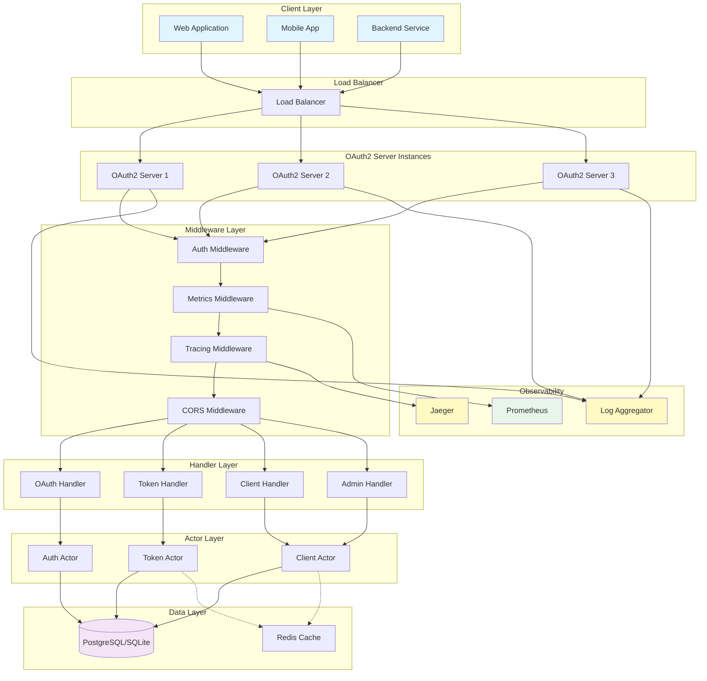
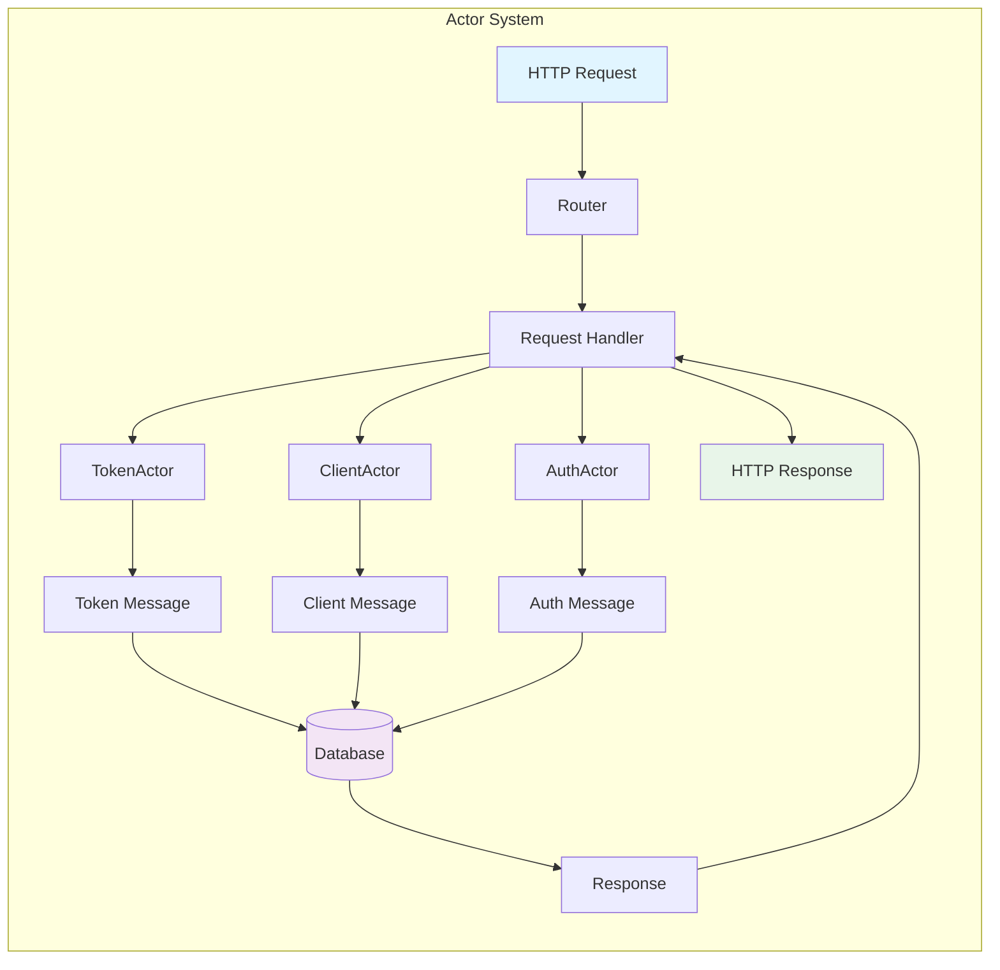
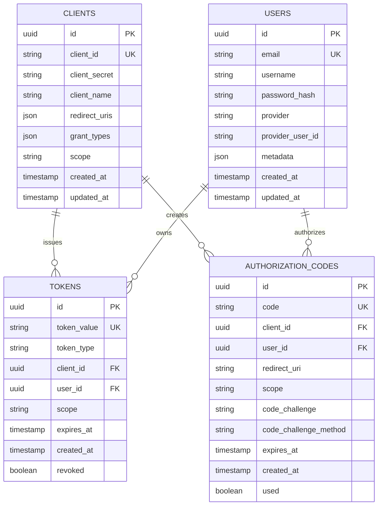
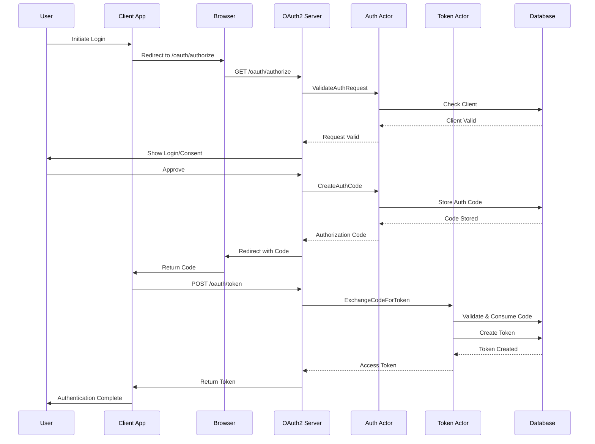
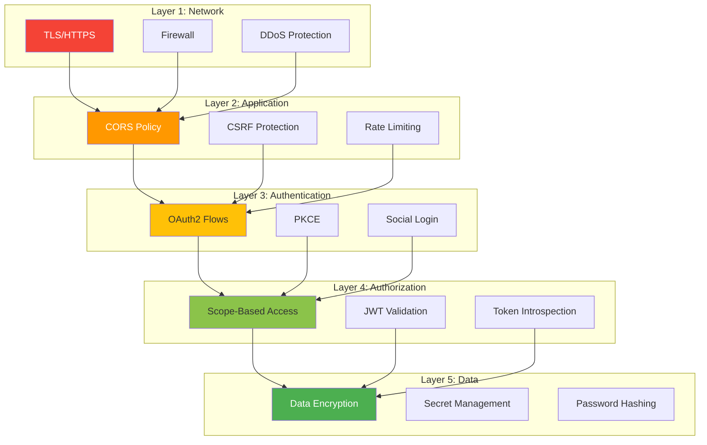
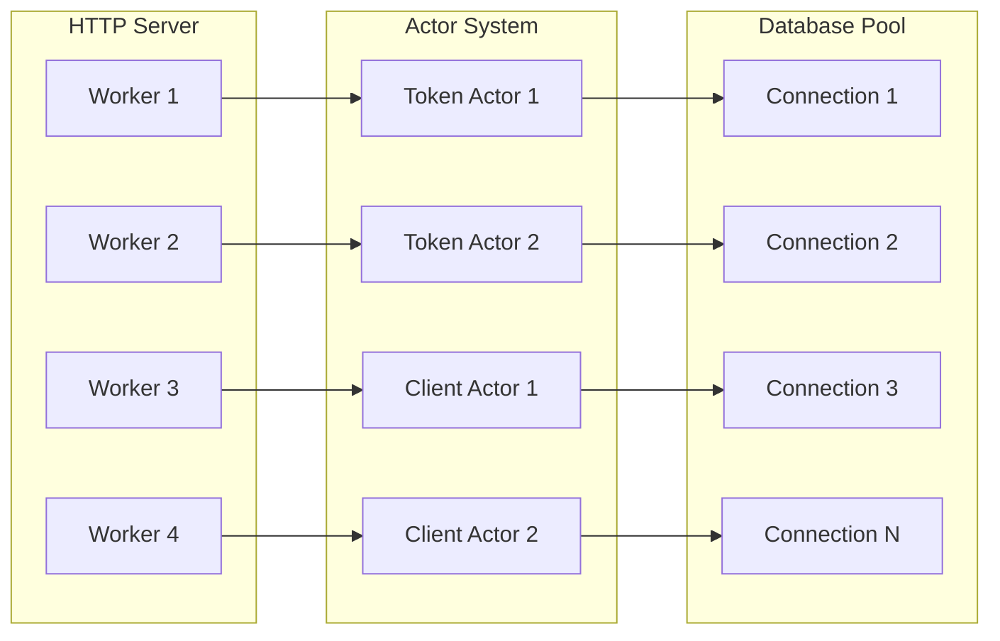
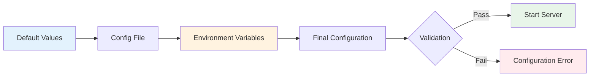
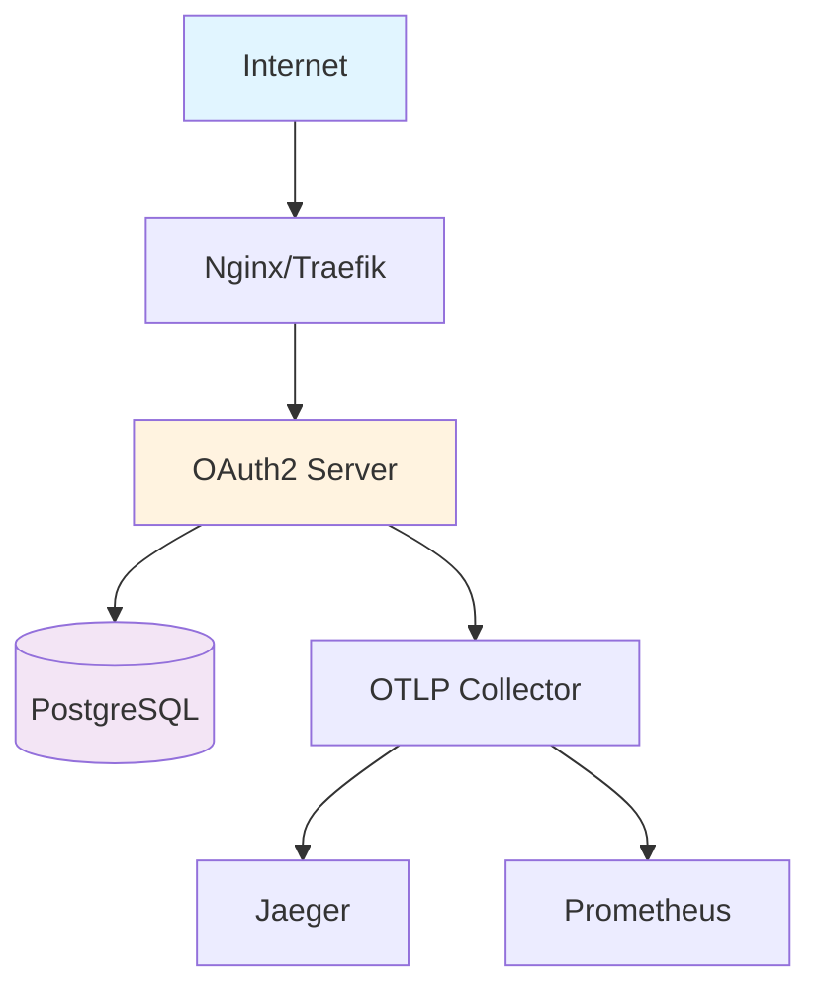
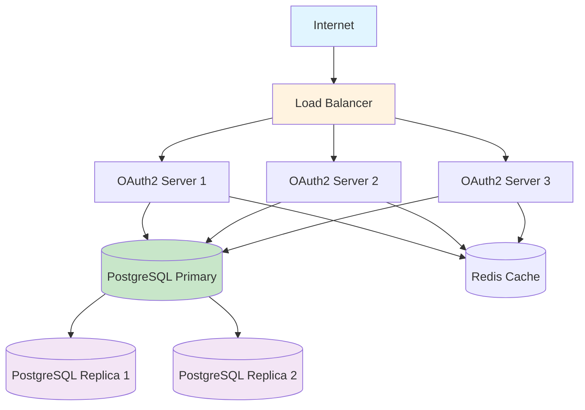

# Architecture Overview

This document provides a comprehensive overview of the Rust OAuth2 Server architecture, design patterns, and implementation details.

## System Architecture

The Rust OAuth2 Server is built using modern architectural patterns that prioritize performance, security, and maintainability.



## Core Components

### 1. HTTP Server (Actix-Web)

The foundation of the application is built on **Actix-Web**, a powerful, pragmatic, and extremely fast web framework for Rust.

**Key Features:**
- Asynchronous request handling
- HTTP/1.x and HTTP/2 support
- WebSocket support
- Streaming and pipelining
- SSL/TLS support via OpenSSL or Rustls
- Middleware support

**Configuration:**
```rust
HttpServer::new(move || {
    App::new()
        .wrap(TracingLogger::default())
        .wrap(SessionMiddleware::new(/* ... */))
        .wrap(Cors::default())
        .wrap(MetricsMiddleware)
        // Routes configuration
})
.workers(4)
.bind("0.0.0.0:8080")?
.run()
```

### 2. Actor Model

The server uses the **Actor Model** for concurrent state management, provided by the Actix framework.



**Benefits:**
- Isolation: Each actor manages its own state
- Concurrency: Actors process messages concurrently
- Fault Tolerance: Actor failures don't cascade
- Scalability: Easy to scale horizontally

See [Actor Model Documentation](actors.md) for detailed implementation.

### 3. Database Layer

The server uses **SQLx** for database interactions, providing compile-time verified SQL queries.

**Supported Databases:**
- SQLite (development/testing)
- PostgreSQL (production)

**Features:**
- Async database operations
- Connection pooling
- Compile-time query verification
- Automatic SQL migration
- Transaction support

**Schema Overview:**



See [Database Documentation](database.md) for schema details and migrations.

## Request Flow

### Complete Request Flow Diagram

```mermaid
sequenceDiagram
    participant Client
    participant LB as Load Balancer
    participant Server as OAuth2 Server
    participant MW as Middleware Stack
    participant Handler as Request Handler
    participant Actor as Actor System
    participant DB as Database
    participant Telemetry as Observability
    
    Client->>LB: HTTP Request
    LB->>Server: Forward Request
    
    Server->>MW: Process Request
    activate MW
    
    MW->>MW: CORS Check
    MW->>MW: Auth Check
    MW->>MW: Start Trace Span
    MW->>Telemetry: Record Metrics
    
    MW->>Handler: Validated Request
    deactivate MW
    activate Handler
    
    Handler->>Actor: Send Message
    activate Actor
    
    Actor->>DB: Query/Update
    activate DB
    DB-->>Actor: Result
    deactivate DB
    
    Actor-->>Handler: Response
    deactivate Actor
    
    Handler->>MW: HTTP Response
    deactivate Handler
    activate MW
    
    MW->>Telemetry: Record Duration
    MW->>Telemetry: End Trace Span
    MW->>Server: Final Response
    deactivate MW
    
    Server->>LB: HTTP Response
    LB->>Client: Forward Response
```

### OAuth2 Authorization Flow



## Component Details

### Middleware Stack

The middleware stack processes all requests in order:

1. **TracingLogger**: Records request/response with spans
2. **SessionMiddleware**: Manages user sessions
3. **CorsMiddleware**: Handles CORS policies
4. **MetricsMiddleware**: Records metrics
5. **AuthMiddleware**: Validates authentication (selective routes)

```rust
App::new()
    .wrap(TracingLogger::default())           // 1. Tracing
    .wrap(SessionMiddleware::new(/*...*/))    // 2. Sessions
    .wrap(Cors::default())                    // 3. CORS
    .wrap(MetricsMiddleware)                  // 4. Metrics
    .service(
        web::scope("/api")
            .wrap(AuthMiddleware)             // 5. Auth (API only)
            .route("/protected", web::get().to(handler))
    )
```

### Handler Layer

Handlers process HTTP requests and coordinate with actors:

**Handler Responsibilities:**
- Request validation
- Parameter extraction
- Actor coordination
- Response formatting
- Error handling

**Example Handler Flow:**
```rust
async fn token_handler(
    req: TokenRequest,
    token_actor: Data<Addr<TokenActor>>,
) -> Result<HttpResponse, OAuth2Error> {
    // 1. Validate request
    req.validate()?;
    
    // 2. Send message to actor
    let result = token_actor
        .send(CreateTokenMessage { /* ... */ })
        .await??;
    
    // 3. Format response
    Ok(HttpResponse::Ok().json(result))
}
```

### JWT Token Structure

The server issues JWT tokens with the following structure:

```json
{
  "header": {
    "alg": "HS256",
    "typ": "JWT"
  },
  "payload": {
    "sub": "user-id",
    "client_id": "client-id",
    "scope": "read write",
    "iss": "rust_oauth2_server",
    "aud": "api.example.com",
    "exp": 1704067200,
    "iat": 1704063600,
    "jti": "token-id"
  }
}
```

**Token Claims:**
- `sub`: Subject (user ID)
- `client_id`: OAuth2 client identifier
- `scope`: Granted scopes
- `iss`: Issuer
- `aud`: Audience
- `exp`: Expiration time
- `iat`: Issued at time
- `jti`: JWT ID (token identifier)

## Security Architecture

### Defense in Depth



### Security Features

1. **PKCE Support**: Protects against authorization code interception
2. **Secure Token Storage**: Tokens hashed in database
3. **Scope-Based Authorization**: Fine-grained access control
4. **Token Revocation**: Immediate token invalidation
5. **Session Security**: Secure, HTTP-only cookies
6. **Password Hashing**: Argon2 for password storage
7. **SQL Injection Prevention**: Parameterized queries via SQLx
8. **XSS Prevention**: Input sanitization and CSP headers
9. **CSRF Protection**: State parameter validation

## Performance Characteristics

### Concurrency Model



**Performance Benefits:**
- **Async I/O**: Non-blocking operations
- **Worker Threads**: CPU core utilization
- **Connection Pooling**: Database efficiency
- **Actor Isolation**: No lock contention
- **Zero-Copy**: Efficient data handling

### Scalability

**Horizontal Scaling:**
- Stateless server design
- Session stored in database/Redis
- Load balancer compatible
- No inter-server communication required

**Vertical Scaling:**
- Multi-threaded workers
- Efficient memory usage
- Fast request processing
- Database connection pooling

## Technology Stack

### Core Technologies

| Component | Technology | Purpose |
|-----------|------------|---------|
| Language | Rust 2021 | Type safety, performance |
| Web Framework | Actix-Web 4.x | HTTP server |
| Actor Framework | Actix 0.13 | Concurrency |
| Database | SQLx | Database access |
| JWT | jsonwebtoken | Token handling |
| Serialization | Serde | JSON processing |
| OpenAPI | utoipa | API documentation |

### Observability Stack

| Component | Technology | Purpose |
|-----------|------------|---------|
| Metrics | Prometheus | Metrics collection |
| Tracing | OpenTelemetry | Distributed tracing |
| Logging | tracing-subscriber | Structured logging |
| Monitoring | Grafana | Metrics visualization |

### Infrastructure

| Component | Technology | Purpose |
|-----------|------------|---------|
| Container | Docker | Containerization |
| Orchestration | Kubernetes | Container orchestration |
| Database | PostgreSQL | Production database |
| Migrations | Flyway | Schema management |
| Reverse Proxy | Nginx/Traefik | Load balancing, TLS |

## Design Principles

### 1. Type Safety

Rust's type system prevents entire classes of bugs:
- No null pointer exceptions
- No data races
- Memory safety without garbage collection
- Compile-time error detection

### 2. Actor Model

Benefits of actor-based concurrency:
- Isolated state management
- Message-passing communication
- Fault tolerance
- Scalable design

### 3. Asynchronous I/O

Non-blocking operations for efficiency:
- Efficient resource utilization
- High concurrency support
- Responsive under load
- Scalable architecture

### 4. Security First

Security built into every layer:
- Secure by default configuration
- Principle of least privilege
- Defense in depth
- Regular security audits

### 5. Observability

Comprehensive monitoring and debugging:
- Structured logging
- Distributed tracing
- Prometheus metrics
- Health checks

## Configuration Architecture

Configuration is loaded in this order:
1. Default values (code)
2. Configuration file
3. Environment variables (override)



## Deployment Architecture

### Single Instance Deployment



### High Availability Deployment



## Extension Points

The architecture supports extensions through:

1. **Custom Grant Types**: Add new OAuth2 flows
2. **Token Enhancers**: Add custom token claims
3. **Event Hooks**: React to OAuth2 events
4. **Custom Middleware**: Add request/response processing
5. **Storage Backends**: Implement alternative storage
6. **Social Providers**: Add new login providers

## Next Steps

- [Actor Model Details](actors.md) - Deep dive into the actor system
- [Database Schema](database.md) - Complete schema documentation
- [API Reference](../api/endpoints.md) - Endpoint documentation
- [Deployment Guide](../deployment/production.md) - Production deployment
