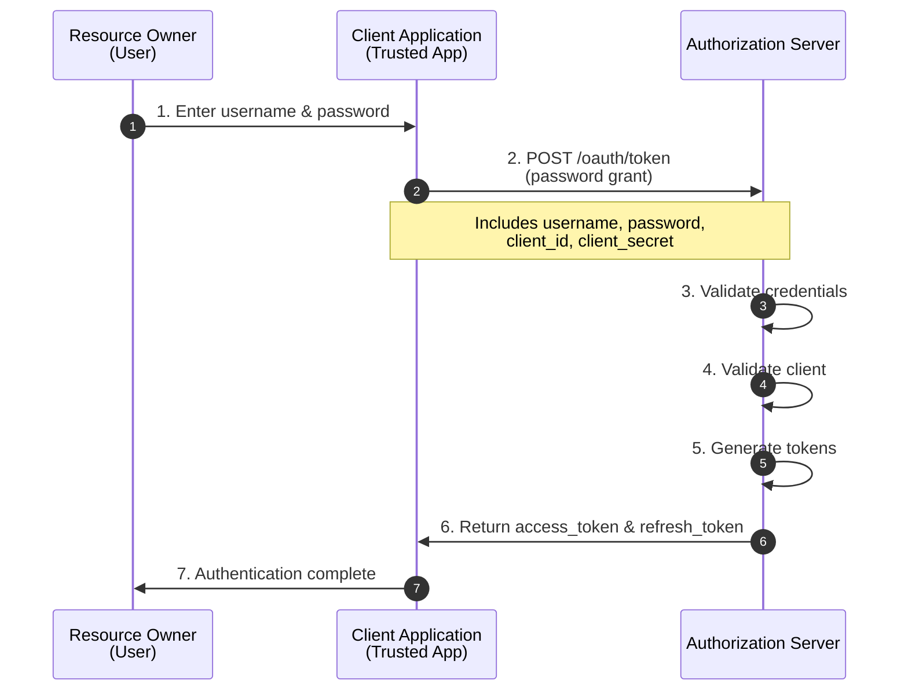

# Resource Owner Password Credentials Flow

The Resource Owner Password Credentials (ROPC) Flow allows applications to directly exchange user credentials (username and password) for access tokens.

!!! danger "Not Recommended"
    This flow should only be used when other flows are not viable. It requires users to share their passwords directly with the client application, which reduces security.

## When to Use (Rarely)

Use this flow **only** when:

- The client is highly trusted (first-party application)
- Other OAuth2 flows are not practical
- Migrating legacy username/password authentication
- Command-line interfaces or desktop apps where browser redirect is impossible

**Prefer instead:**

- [Authorization Code Flow](authorization-code.md) for web/mobile apps
- [Client Credentials Flow](client-credentials.md) for service accounts

## Flow Diagram



## Implementation

### Request Access Token

**HTTP Request:**

```http
POST /oauth/token HTTP/1.1
Host: oauth2-server.example.com
Content-Type: application/x-www-form-urlencoded

grant_type=password&
username=user@example.com&
password=user_password&
client_id=YOUR_CLIENT_ID&
client_secret=YOUR_CLIENT_SECRET&
scope=read write
```

**Parameters:**

| Parameter | Required | Description |
|-----------|----------|-------------|
| `grant_type` | Yes | Must be `password` |
| `username` | Yes | User's username or email |
| `password` | Yes | User's password |
| `client_id` | Yes | The client identifier |
| `client_secret` | Yes | The client secret |
| `scope` | No | Requested scopes |

### Success Response

```json
{
  "access_token": "eyJhbGciOiJIUzI1NiIsInR5cCI6IkpXVCJ9...",
  "token_type": "Bearer",
  "expires_in": 3600,
  "refresh_token": "refresh_1a2b3c4d5e6f7g8h9i0j",
  "scope": "read write"
}
```

### Error Response

```json
{
  "error": "invalid_grant",
  "error_description": "Invalid username or password"
}
```

## Code Examples

### cURL

```bash
curl -X POST http://localhost:8080/oauth/token \
  -H "Content-Type: application/x-www-form-urlencoded" \
  -d "grant_type=password" \
  -d "username=user@example.com" \
  -d "password=user_password" \
  -d "client_id=YOUR_CLIENT_ID" \
  -d "client_secret=YOUR_CLIENT_SECRET" \
  -d "scope=read write"
```

### JavaScript

```javascript
async function loginWithPassword(username, password) {
  const params = new URLSearchParams({
    grant_type: 'password',
    username: username,
    password: password,
    client_id: process.env.CLIENT_ID,
    client_secret: process.env.CLIENT_SECRET,
    scope: 'read write'
  });
  
  try {
    const response = await fetch('http://localhost:8080/oauth/token', {
      method: 'POST',
      headers: {
        'Content-Type': 'application/x-www-form-urlencoded'
      },
      body: params
    });
    
    if (!response.ok) {
      const error = await response.json();
      throw new Error(error.error_description || 'Authentication failed');
    }
    
    return await response.json();
  } catch (error) {
    console.error('Login failed:', error);
    throw error;
  }
}

// Usage
const tokens = await loginWithPassword('user@example.com', 'password123');
console.log('Access token:', tokens.access_token);
```

### Python

```python
import requests
import os

def login_with_password(username, password):
    url = 'http://localhost:8080/oauth/token'
    
    data = {
        'grant_type': 'password',
        'username': username,
        'password': password,
        'client_id': os.environ['CLIENT_ID'],
        'client_secret': os.environ['CLIENT_SECRET'],
        'scope': 'read write'
    }
    
    response = requests.post(url, data=data)
    response.raise_for_status()
    
    return response.json()

# Usage
tokens = login_with_password('user@example.com', 'password123')
print(f"Access token: {tokens['access_token']}")
```

## Security Considerations

### 1. Password Exposure Risk

The password is exposed to the client application:

```javascript
// ❌ Password flows through client code
async function login(username, password) {
  // Password is visible in client application
  return await loginWithPassword(username, password);
}

// ✅ Better: Use authorization code flow
function login() {
  window.location.href = getAuthorizationUrl();
}
```

### 2. Credential Validation

Never store passwords in plain text:

```javascript
// Server-side validation (example)
async function validateCredentials(username, password) {
  const user = await db.findUserByUsername(username);
  
  if (!user) {
    throw new Error('Invalid credentials');
  }
  
  // ✅ Use secure password hashing (Argon2, bcrypt)
  const valid = await argon2.verify(user.password_hash, password);
  
  if (!valid) {
    throw new Error('Invalid credentials');
  }
  
  return user;
}
```

### 3. Rate Limiting

Implement aggressive rate limiting:

```javascript
// Rate limit password grant requests
const rateLimiter = {
  maxAttempts: 5,
  windowMs: 15 * 60 * 1000 // 15 minutes
};

// Lockout after failed attempts
if (failedAttempts >= 5) {
  throw new Error('Account temporarily locked');
}
```

### 4. Audit Logging

Log all authentication attempts:

```javascript
async function auditLoginAttempt(username, success, clientId, ipAddress) {
  await db.logAuthAttempt({
    username,
    success,
    clientId,
    ipAddress,
    timestamp: new Date(),
    grantType: 'password'
  });
  
  // Alert on suspicious patterns
  if (!success) {
    await checkForBruteForce(username, ipAddress);
  }
}
```

## Migration Path

If using password flow, plan migration to more secure flows:

### Phase 1: Current State (Password Flow)

```javascript
// Legacy authentication
const tokens = await loginWithPassword(username, password);
```

### Phase 2: Add Authorization Code Support

```javascript
// Support both methods
if (canUseAuthCode()) {
  initiateAuthCodeFlow();
} else {
  const tokens = await loginWithPassword(username, password);
}
```

### Phase 3: Migrate Users

```javascript
// Encourage users to switch
if (user.usingPasswordFlow) {
  showMigrationPrompt();
}
```

### Phase 4: Deprecate Password Flow

```javascript
// Eventually disable password flow
if (grantType === 'password') {
  throw new Error('Password flow deprecated. Use authorization code flow.');
}
```

## Best Practices

1. **Avoid if possible** - Use authorization code flow instead
2. **Use only for trusted clients** - First-party applications only
3. **Implement MFA** - Add second factor authentication
4. **Rate limit aggressively** - Prevent brute force attacks
5. **Log all attempts** - Monitor for suspicious activity
6. **Use HTTPS** - Always encrypt credentials in transit
7. **Never log passwords** - Don't log request bodies
8. **Implement account lockout** - After failed attempts
9. **Plan migration** - To more secure flows
10. **Consider alternatives** - Device code flow for CLIs

## Error Handling

```javascript
async function loginWithErrorHandling(username, password) {
  try {
    return await loginWithPassword(username, password);
  } catch (error) {
    if (error.response?.data?.error) {
      const { error: code, error_description } = error.response.data;
      
      switch (code) {
        case 'invalid_grant':
          return {
            success: false,
            message: 'Invalid username or password'
          };
          
        case 'unauthorized_client':
          return {
            success: false,
            message: 'This application cannot use password authentication'
          };
          
        case 'invalid_scope':
          return {
            success: false,
            message: 'Requested permissions not available'
          };
          
        default:
          return {
            success: false,
            message: 'Authentication failed'
          };
      }
    }
    
    throw error;
  }
}
```

## Alternatives to Consider

### 1. Authorization Code Flow with PKCE

Best for web and mobile apps:

```javascript
// More secure - no password exposure
initiateAuthCodeFlowWithPKCE();
```

### 2. Device Code Flow

For CLI tools and devices:

```bash
$ my-cli login
Visit: https://oauth.example.com/device
Enter code: ABCD-1234

# User enters code in browser
# CLI polls for completion
```

### 3. Client Credentials Flow

For service accounts:

```javascript
// No user credentials needed
const tokens = await getClientCredentialsToken();
```

## Complete Example: CLI Tool

```javascript
const readline = require('readline');
const axios = require('axios');

class CLIAuthenticator {
  constructor(config) {
    this.config = config;
    this.rl = readline.createInterface({
      input: process.stdin,
      output: process.stdout
    });
  }
  
  async prompt(question) {
    return new Promise((resolve) => {
      this.rl.question(question, (answer) => {
        resolve(answer);
      });
    });
  }
  
  async promptPassword(question) {
    return new Promise((resolve) => {
      const stdin = process.stdin;
      stdin.setRawMode(true);
      stdin.resume();
      stdin.setEncoding('utf8');
      
      process.stdout.write(question);
      
      let password = '';
      stdin.on('data', (char) => {
        if (char === '\n' || char === '\r' || char === '\u0004') {
          stdin.setRawMode(false);
          stdin.pause();
          process.stdout.write('\n');
          resolve(password);
        } else if (char === '\u0003') {
          process.exit();
        } else if (char === '\u007f') {
          password = password.slice(0, -1);
        } else {
          password += char;
          process.stdout.write('*');
        }
      });
    });
  }
  
  async login() {
    console.log('=== Login ===');
    const username = await this.prompt('Username: ');
    const password = await this.promptPassword('Password: ');
    
    try {
      const tokens = await this.authenticateWithPassword(username, password);
      console.log('\n✓ Login successful!');
      
      // Store tokens securely
      await this.storeTokens(tokens);
      
      return tokens;
    } catch (error) {
      console.error('\n✗ Login failed:', error.message);
      throw error;
    } finally {
      this.rl.close();
    }
  }
  
  async authenticateWithPassword(username, password) {
    const params = new URLSearchParams({
      grant_type: 'password',
      username,
      password,
      client_id: this.config.clientId,
      client_secret: this.config.clientSecret,
      scope: this.config.scope
    });
    
    const response = await axios.post(
      this.config.tokenUrl,
      params,
      {
        headers: {
          'Content-Type': 'application/x-www-form-urlencoded'
        }
      }
    );
    
    return response.data;
  }
  
  async storeTokens(tokens) {
    // Store in secure location (e.g., keychain, credential manager)
    // This is platform-specific
  }
}

// Usage
const auth = new CLIAuthenticator({
  tokenUrl: 'http://localhost:8080/oauth/token',
  clientId: process.env.CLIENT_ID,
  clientSecret: process.env.CLIENT_SECRET,
  scope: 'read write'
});

auth.login()
  .then(() => console.log('Ready to use CLI'))
  .catch(() => process.exit(1));
```

## Next Steps

- [Authorization Code Flow](authorization-code.md) - Recommended alternative
- [Client Credentials Flow](client-credentials.md) - For service accounts
- [Refresh Token Flow](refresh-token.md) - Token refresh
- [Security Best Practices](../deployment/production.md#security) - Secure implementation
