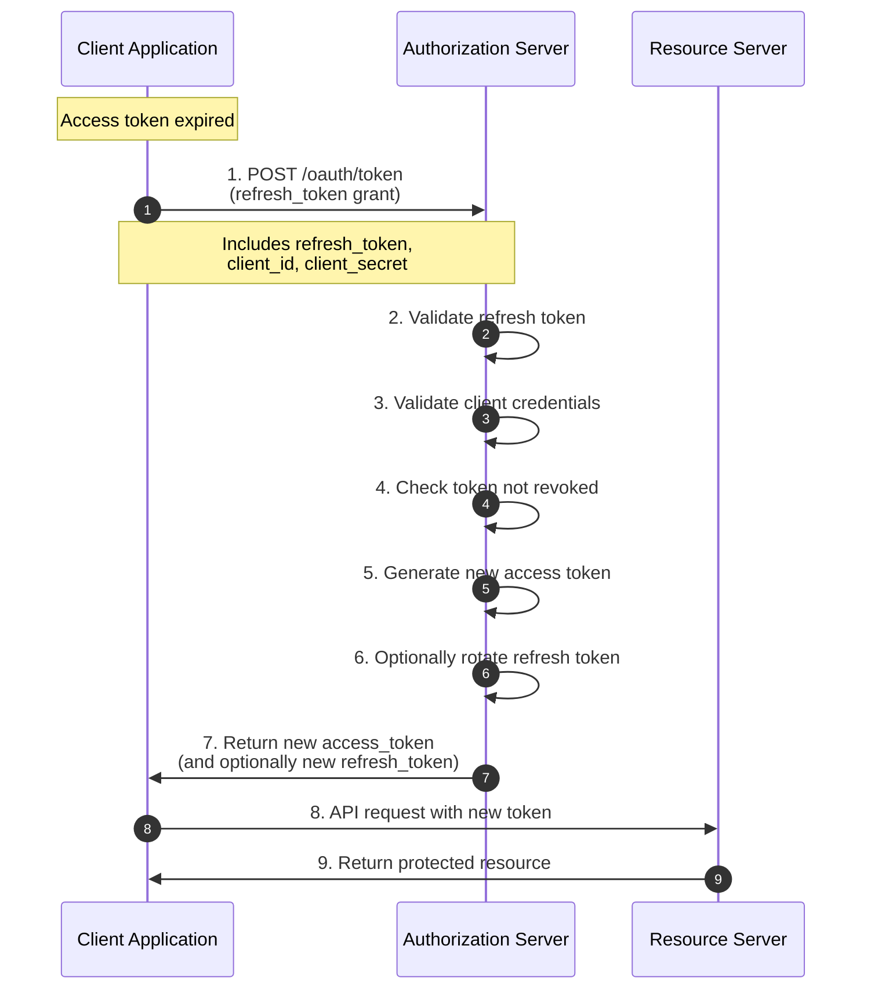
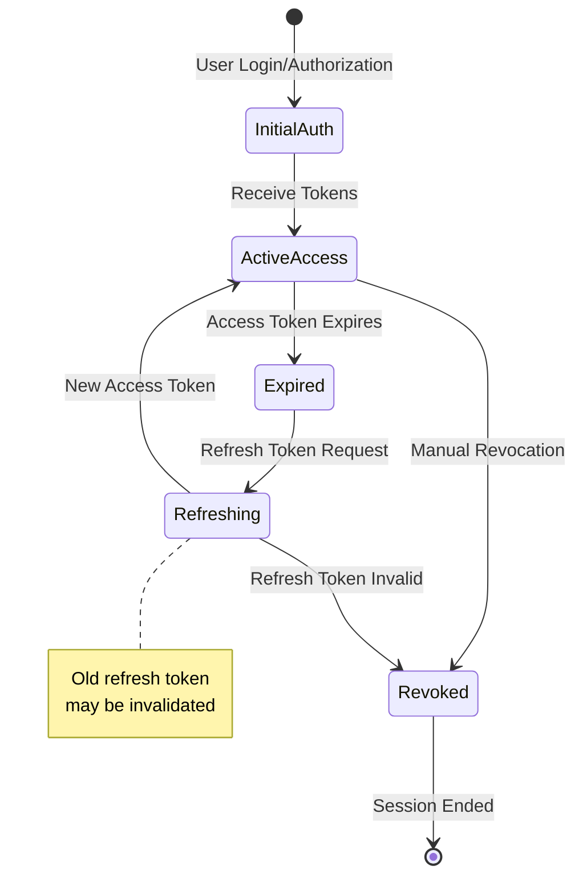
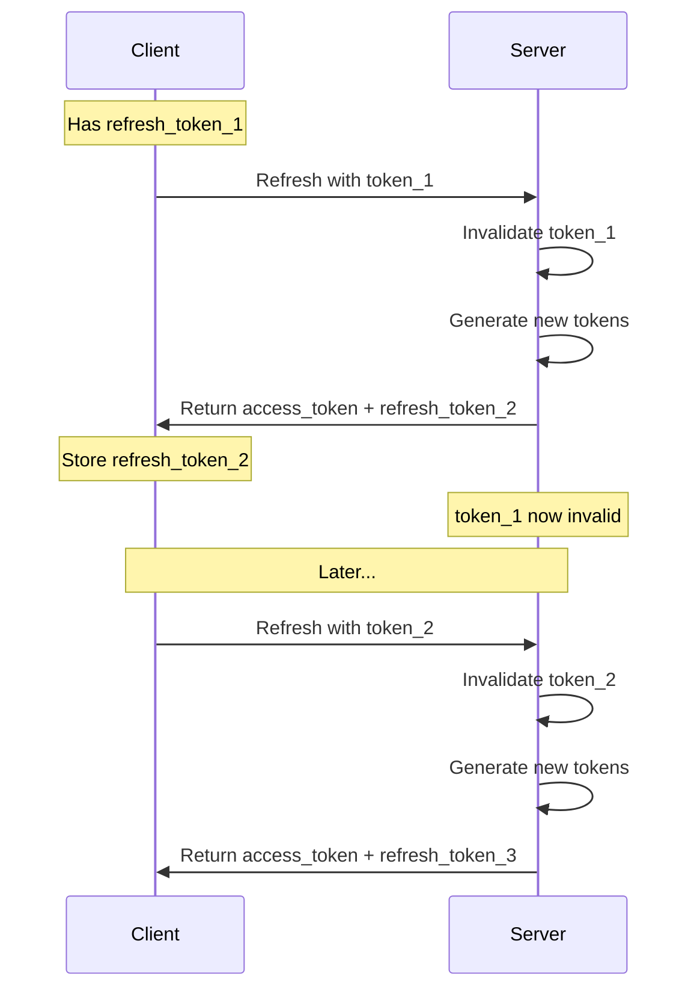

# Refresh Token Flow

The Refresh Token Flow allows clients to obtain new access tokens without requiring user re-authentication. This is essential for long-lived applications that need continuous access to protected resources.

## Overview

Refresh tokens are used when:

- Access tokens expire
- User sessions need to be extended
- Applications need long-term access without user interaction

**Key Characteristics:**

- Refresh tokens are long-lived (days/weeks/months)
- Access tokens are short-lived (minutes/hours)
- Refresh tokens can be revoked
- New refresh token may be issued on refresh

## Flow Diagram



## Token Lifecycle



## Implementation

### Request New Access Token

**HTTP Request:**

```http
POST /oauth/token HTTP/1.1
Host: oauth2-server.example.com
Content-Type: application/x-www-form-urlencoded

grant_type=refresh_token&
refresh_token=YOUR_REFRESH_TOKEN&
client_id=YOUR_CLIENT_ID&
client_secret=YOUR_CLIENT_SECRET&
scope=read
```

**Parameters:**

| Parameter | Required | Description |
|-----------|----------|-------------|
| `grant_type` | Yes | Must be `refresh_token` |
| `refresh_token` | Yes | The refresh token from initial authorization |
| `client_id` | Yes | The client identifier |
| `client_secret` | Yes | The client secret (for confidential clients) |
| `scope` | No | Requested scope (must be subset of original) |

### Success Response

```json
{
  "access_token": "eyJhbGciOiJIUzI1NiIsInR5cCI6IkpXVCJ9...",
  "token_type": "Bearer",
  "expires_in": 3600,
  "refresh_token": "new_refresh_token_value",
  "scope": "read write"
}
```

**Response Fields:**

| Field | Description |
|-------|-------------|
| `access_token` | New JWT access token |
| `token_type` | Always "Bearer" |
| `expires_in` | Token lifetime in seconds |
| `refresh_token` | New refresh token (optional, may be same as original) |
| `scope` | Granted scopes |

### Error Response

```json
{
  "error": "invalid_grant",
  "error_description": "The refresh token is invalid or expired"
}
```

## Code Examples

### JavaScript/Node.js

```javascript
async function refreshAccessToken(refreshToken) {
  const params = new URLSearchParams({
    grant_type: 'refresh_token',
    refresh_token: refreshToken,
    client_id: process.env.CLIENT_ID,
    client_secret: process.env.CLIENT_SECRET
  });
  
  try {
    const response = await fetch('http://localhost:8080/oauth/token', {
      method: 'POST',
      headers: {
        'Content-Type': 'application/x-www-form-urlencoded'
      },
      body: params
    });
    
    if (!response.ok) {
      const error = await response.json();
      throw new Error(`Token refresh failed: ${error.error_description}`);
    }
    
    return await response.json();
  } catch (error) {
    console.error('Failed to refresh token:', error);
    throw error;
  }
}

// Usage
const tokens = await refreshAccessToken(currentRefreshToken);
console.log('New access token:', tokens.access_token);

// Update stored tokens
if (tokens.refresh_token) {
  // New refresh token issued - store it
  currentRefreshToken = tokens.refresh_token;
}
```

### Python

```python
import requests
import os

def refresh_access_token(refresh_token):
    url = 'http://localhost:8080/oauth/token'
    
    data = {
        'grant_type': 'refresh_token',
        'refresh_token': refresh_token,
        'client_id': os.environ['CLIENT_ID'],
        'client_secret': os.environ['CLIENT_SECRET']
    }
    
    response = requests.post(url, data=data)
    response.raise_for_status()
    
    tokens = response.json()
    
    # Update refresh token if new one issued
    if 'refresh_token' in tokens:
        # Store new refresh token
        pass
    
    return tokens

# Usage
tokens = refresh_access_token(current_refresh_token)
print(f"New access token: {tokens['access_token']}")
```

### cURL

```bash
curl -X POST http://localhost:8080/oauth/token \
  -H "Content-Type: application/x-www-form-urlencoded" \
  -d "grant_type=refresh_token" \
  -d "refresh_token=YOUR_REFRESH_TOKEN" \
  -d "client_id=YOUR_CLIENT_ID" \
  -d "client_secret=YOUR_CLIENT_SECRET"
```

## Token Management Strategies

### 1. Proactive Refresh

Refresh tokens before they expire:

```javascript
class TokenManager {
  constructor() {
    this.accessToken = null;
    this.refreshToken = null;
    this.expiresAt = null;
  }
  
  async getAccessToken() {
    // Refresh if token expires in less than 5 minutes
    const bufferTime = 5 * 60 * 1000; // 5 minutes
    
    if (!this.accessToken || Date.now() >= (this.expiresAt - bufferTime)) {
      await this.refreshTokens();
    }
    
    return this.accessToken;
  }
  
  async refreshTokens() {
    if (!this.refreshToken) {
      throw new Error('No refresh token available');
    }
    
    const tokens = await refreshAccessToken(this.refreshToken);
    
    this.accessToken = tokens.access_token;
    this.expiresAt = Date.now() + (tokens.expires_in * 1000);
    
    // Update refresh token if rotated
    if (tokens.refresh_token) {
      this.refreshToken = tokens.refresh_token;
    }
  }
  
  setTokens(accessToken, refreshToken, expiresIn) {
    this.accessToken = accessToken;
    this.refreshToken = refreshToken;
    this.expiresAt = Date.now() + (expiresIn * 1000);
  }
}

// Usage
const tokenManager = new TokenManager();
tokenManager.setTokens(initialAccessToken, initialRefreshToken, 3600);

// Later - automatically refreshes if needed
const token = await tokenManager.getAccessToken();
```

### 2. Reactive Refresh on 401

Refresh tokens when API returns 401:

```javascript
async function apiCallWithAutoRefresh(url, options = {}) {
  let token = await tokenManager.getAccessToken();
  
  let response = await fetch(url, {
    ...options,
    headers: {
      ...options.headers,
      'Authorization': `Bearer ${token}`
    }
  });
  
  // If 401, try refreshing token once
  if (response.status === 401) {
    await tokenManager.refreshTokens();
    token = await tokenManager.getAccessToken();
    
    // Retry request with new token
    response = await fetch(url, {
      ...options,
      headers: {
        ...options.headers,
        'Authorization': `Bearer ${token}`
      }
    });
  }
  
  return response;
}
```

### 3. Background Refresh Timer

Automatically refresh tokens in the background:

```javascript
class AutoRefreshTokenManager {
  constructor() {
    this.tokenManager = new TokenManager();
    this.refreshTimer = null;
  }
  
  startAutoRefresh() {
    // Refresh 5 minutes before expiration
    const refreshTime = (this.tokenManager.expiresAt - Date.now()) - (5 * 60 * 1000);
    
    if (refreshTime > 0) {
      this.refreshTimer = setTimeout(async () => {
        try {
          await this.tokenManager.refreshTokens();
          this.startAutoRefresh(); // Schedule next refresh
        } catch (error) {
          console.error('Auto-refresh failed:', error);
          // Emit event for re-authentication
          this.emit('authenticationRequired');
        }
      }, refreshTime);
    }
  }
  
  stopAutoRefresh() {
    if (this.refreshTimer) {
      clearTimeout(this.refreshTimer);
      this.refreshTimer = null;
    }
  }
}
```

## Refresh Token Rotation

Some OAuth2 servers implement refresh token rotation for enhanced security.

### Rotation Flow



### Handling Token Rotation

```javascript
async function handleTokenRefresh(refreshToken) {
  const newTokens = await refreshAccessToken(refreshToken);
  
  // Important: Store the new refresh token immediately
  if (newTokens.refresh_token) {
    await secureStorage.setRefreshToken(newTokens.refresh_token);
    console.log('Refresh token rotated - new token stored');
  }
  
  // Store access token
  await secureStorage.setAccessToken(newTokens.access_token);
  
  return newTokens;
}
```

## Security Considerations

### 1. Secure Storage

Store refresh tokens securely:

```javascript
// ✅ Good: Secure storage
// Backend (Node.js)
const session = require('express-session');
app.use(session({
  secret: process.env.SESSION_SECRET,
  cookie: {
    secure: true,      // HTTPS only
    httpOnly: true,    // Not accessible via JavaScript
    sameSite: 'strict'
  }
}));

// Store in session
req.session.refreshToken = tokens.refresh_token;

// ❌ Bad: Insecure storage
localStorage.setItem('refresh_token', token);  // DON'T DO THIS!
```

### 2. Refresh Token Expiration

Set appropriate expiration times:

```javascript
// Configuration
const TOKEN_CONFIG = {
  accessTokenExpiration: 3600,        // 1 hour
  refreshTokenExpiration: 2592000,    // 30 days
  absoluteRefreshExpiration: 7776000  // 90 days (absolute maximum)
};
```

### 3. Revocation

Implement token revocation:

```javascript
async function logout() {
  try {
    // Revoke refresh token
    await revokeToken(refreshToken);
    
    // Clear local storage
    tokenManager.clear();
    
    // Redirect to login
    window.location.href = '/login';
  } catch (error) {
    console.error('Logout failed:', error);
  }
}

async function revokeToken(token) {
  const params = new URLSearchParams({
    token: token,
    client_id: CLIENT_ID,
    client_secret: CLIENT_SECRET
  });
  
  await fetch('http://localhost:8080/oauth/revoke', {
    method: 'POST',
    headers: { 'Content-Type': 'application/x-www-form-urlencoded' },
    body: params
  });
}
```

### 4. Detect Token Theft

Implement detection mechanisms:

```javascript
// Server-side: Track token usage
async function validateRefreshToken(refreshToken, clientInfo) {
  const tokenData = await db.getRefreshToken(refreshToken);
  
  // Check if token already used (possible theft)
  if (tokenData.used && tokenData.rotated) {
    // Token reuse detected - revoke entire token family
    await revokeTokenFamily(tokenData.family_id);
    throw new Error('Token reuse detected - possible theft');
  }
  
  // Check client fingerprint
  if (tokenData.client_fingerprint !== clientInfo.fingerprint) {
    // Different client using token
    await revokeTokenFamily(tokenData.family_id);
    throw new Error('Token used by different client');
  }
  
  return tokenData;
}
```

## Error Handling

### Common Errors

| Error Code | Description | Action |
|------------|-------------|--------|
| `invalid_grant` | Refresh token invalid/expired | Re-authenticate user |
| `invalid_client` | Invalid client credentials | Check client_id/secret |
| `unauthorized_client` | Client not authorized | Check client configuration |
| `invalid_scope` | Requested scope not allowed | Request valid scopes |

### Comprehensive Error Handling

```javascript
async function refreshWithErrorHandling(refreshToken) {
  try {
    return await refreshAccessToken(refreshToken);
  } catch (error) {
    if (error.response?.data?.error) {
      const { error: code, error_description } = error.response.data;
      
      switch (code) {
        case 'invalid_grant':
          // Refresh token expired or revoked - need re-authentication
          await clearTokens();
          redirectToLogin();
          throw new Error('Session expired - please log in again');
          
        case 'invalid_client':
          // Configuration error
          console.error('Client configuration error:', error_description);
          throw new Error('Authentication configuration error');
          
        default:
          throw new Error(`Token refresh failed: ${error_description}`);
      }
    }
    throw error;
  }
}
```

## Best Practices

1. **Refresh proactively** before token expiration
2. **Store refresh tokens securely** (never in localStorage)
3. **Handle token rotation** properly
4. **Implement retry logic** with exponential backoff
5. **Revoke tokens on logout**
6. **Monitor refresh failures** and alert on anomalies
7. **Use absolute expiration** limits
8. **Implement token theft detection**
9. **Clear tokens on auth errors**
10. **Use HTTPS** in production

## Complete Example: React App

```javascript
import { createContext, useContext, useState, useEffect } from 'react';

const AuthContext = createContext();

export function AuthProvider({ children }) {
  const [tokens, setTokens] = useState(null);
  const [loading, setLoading] = useState(true);
  
  useEffect(() => {
    // Load tokens from secure storage on mount
    loadTokens();
    
    // Setup auto-refresh
    const interval = setupAutoRefresh();
    
    return () => clearInterval(interval);
  }, []);
  
  async function loadTokens() {
    try {
      const stored = await secureStorage.getTokens();
      if (stored) {
        setTokens(stored);
      }
    } finally {
      setLoading(false);
    }
  }
  
  function setupAutoRefresh() {
    return setInterval(async () => {
      if (tokens?.refresh_token) {
        try {
          await refreshTokens();
        } catch (error) {
          console.error('Auto-refresh failed:', error);
          logout();
        }
      }
    }, 10 * 60 * 1000); // Check every 10 minutes
  }
  
  async function refreshTokens() {
    const newTokens = await refreshAccessToken(tokens.refresh_token);
    setTokens(newTokens);
    await secureStorage.setTokens(newTokens);
  }
  
  async function logout() {
    if (tokens?.refresh_token) {
      await revokeToken(tokens.refresh_token);
    }
    setTokens(null);
    await secureStorage.clearTokens();
  }
  
  const value = {
    tokens,
    loading,
    refreshTokens,
    logout
  };
  
  return <AuthContext.Provider value={value}>{children}</AuthContext.Provider>;
}

export const useAuth = () => useContext(AuthContext);
```

## Monitoring

Track refresh token metrics:

```javascript
const metrics = {
  refreshAttempts: 0,
  refreshSuccesses: 0,
  refreshFailures: 0,
  avgRefreshTime: 0
};

async function refreshWithMetrics(refreshToken) {
  const start = Date.now();
  metrics.refreshAttempts++;
  
  try {
    const tokens = await refreshAccessToken(refreshToken);
    metrics.refreshSuccesses++;
    return tokens;
  } catch (error) {
    metrics.refreshFailures++;
    throw error;
  } finally {
    const duration = Date.now() - start;
    metrics.avgRefreshTime = 
      (metrics.avgRefreshTime + duration) / 2;
  }
}
```

## Next Steps

- [Authorization Code Flow](authorization-code.md) - Initial token acquisition
- [Client Credentials Flow](client-credentials.md) - Service authentication
- [Token Revocation](../api/endpoints.md#token-revocation) - Revoking tokens
- [Security Best Practices](../deployment/production.md#security) - Secure token handling
