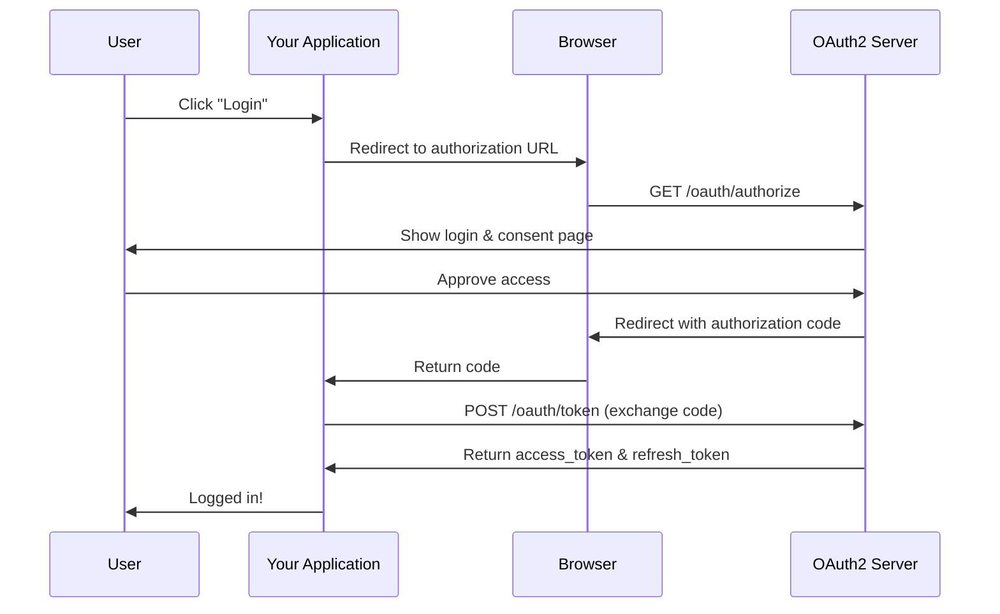
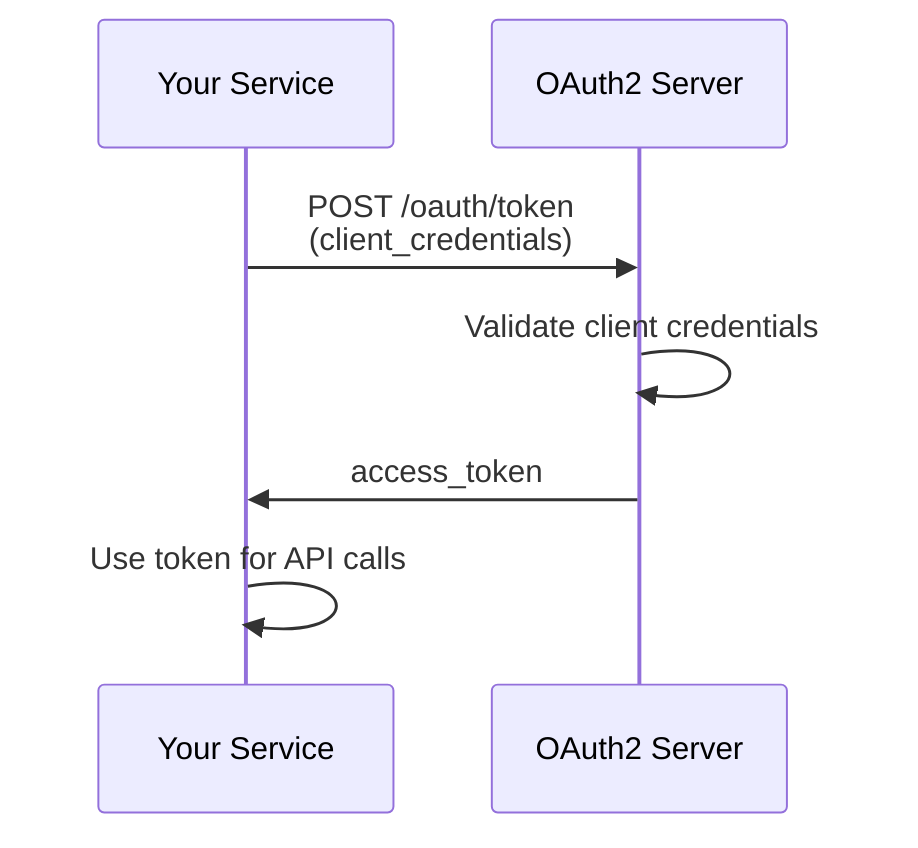

# Quick Start Guide

Get your OAuth2 server up and running in minutes! This guide will walk you through the essential steps to start using the OAuth2 server.

## Prerequisites

Before starting, make sure you have completed the [Installation Guide](installation.md).

## Starting the Server

### Development Mode

```bash
cd rust_oauth2
cargo run
```

The server will start on `http://localhost:8080` by default.

### Production Mode

```bash
cargo run --release
```

## Your First OAuth2 Flow

### Step 1: Register a Client

Every application that wants to use your OAuth2 server needs to register as a client.

```bash
curl -X POST http://localhost:8080/clients/register \
  -H "Content-Type: application/json" \
  -d '{
    "client_name": "My First App",
    "redirect_uris": ["http://localhost:3000/callback"],
    "grant_types": ["authorization_code", "refresh_token"],
    "scope": "read write"
  }'
```

**Response:**

```json
{
  "client_id": "8f9a7b6c-5d4e-3f2a-1b0c-9d8e7f6a5b4c",
  "client_secret": "secret_1a2b3c4d5e6f7g8h9i0j",
  "client_name": "My First App",
  "redirect_uris": ["http://localhost:3000/callback"],
  "grant_types": ["authorization_code", "refresh_token"],
  "scope": "read write",
  "created_at": "2024-01-01T00:00:00Z"
}
```

!!! tip "Save Your Credentials"
    Save the `client_id` and `client_secret` - you'll need them for authentication!

### Step 2: Authorize Your Application

#### Authorization Code Flow (Most Common)

This is the recommended flow for web applications and mobile apps.



**Step 2.1: Redirect User to Authorization Endpoint**

```
http://localhost:8080/oauth/authorize?response_type=code&client_id=YOUR_CLIENT_ID&redirect_uri=http://localhost:3000/callback&scope=read%20write&state=random_state_string
```

**Query Parameters:**

- `response_type`: Must be `code` for authorization code flow
- `client_id`: Your client ID from Step 1
- `redirect_uri`: Must match one of your registered URIs
- `scope`: Space-separated list of scopes (URL encoded)
- `state`: Random string to prevent CSRF attacks

**Step 2.2: User Approves Access**

The user will see a login/consent page. After approval, they'll be redirected to:

```
http://localhost:3000/callback?code=AUTH_CODE_HERE&state=random_state_string
```

**Step 2.3: Exchange Code for Token**

```bash
curl -X POST http://localhost:8080/oauth/token \
  -H "Content-Type: application/x-www-form-urlencoded" \
  -d "grant_type=authorization_code" \
  -d "code=AUTH_CODE_HERE" \
  -d "redirect_uri=http://localhost:3000/callback" \
  -d "client_id=YOUR_CLIENT_ID" \
  -d "client_secret=YOUR_CLIENT_SECRET"
```

**Response:**

```json
{
  "access_token": "eyJhbGciOiJIUzI1NiIsInR5cCI6IkpXVCJ9...",
  "token_type": "Bearer",
  "expires_in": 3600,
  "refresh_token": "refresh_1a2b3c4d5e6f7g8h9i0j",
  "scope": "read write"
}
```

### Step 3: Use the Access Token

Use the access token to authenticate API requests:

```bash
curl http://your-api.com/api/resource \
  -H "Authorization: Bearer YOUR_ACCESS_TOKEN"
```

### Step 4: Refresh the Token

When the access token expires, use the refresh token to get a new one:

```bash
curl -X POST http://localhost:8080/oauth/token \
  -H "Content-Type: application/x-www-form-urlencoded" \
  -d "grant_type=refresh_token" \
  -d "refresh_token=YOUR_REFRESH_TOKEN" \
  -d "client_id=YOUR_CLIENT_ID" \
  -d "client_secret=YOUR_CLIENT_SECRET"
```

## Alternative OAuth2 Flows

### Client Credentials Flow (Service-to-Service)

For backend services that don't require user interaction:

```bash
curl -X POST http://localhost:8080/oauth/token \
  -H "Content-Type: application/x-www-form-urlencoded" \
  -d "grant_type=client_credentials" \
  -d "client_id=YOUR_CLIENT_ID" \
  -d "client_secret=YOUR_CLIENT_SECRET" \
  -d "scope=read"
```



### Resource Owner Password Flow

!!! warning "Not Recommended"
    Only use this flow for trusted first-party applications. It requires the user to share their password with the client.

```bash
curl -X POST http://localhost:8080/oauth/token \
  -H "Content-Type: application/x-www-form-urlencoded" \
  -d "grant_type=password" \
  -d "username=user@example.com" \
  -d "password=user_password" \
  -d "client_id=YOUR_CLIENT_ID" \
  -d "client_secret=YOUR_CLIENT_SECRET" \
  -d "scope=read"
```

## Token Management

### Introspect a Token

Check if a token is valid and get its metadata:

```bash
curl -X POST http://localhost:8080/oauth/introspect \
  -H "Content-Type: application/x-www-form-urlencoded" \
  -d "token=YOUR_ACCESS_TOKEN" \
  -d "client_id=YOUR_CLIENT_ID" \
  -d "client_secret=YOUR_CLIENT_SECRET"
```

**Response:**

```json
{
  "active": true,
  "scope": "read write",
  "client_id": "8f9a7b6c-5d4e-3f2a-1b0c-9d8e7f6a5b4c",
  "exp": 1704067200,
  "iat": 1704063600
}
```

### Revoke a Token

Invalidate a token before it expires:

```bash
curl -X POST http://localhost:8080/oauth/revoke \
  -H "Content-Type: application/x-www-form-urlencoded" \
  -d "token=YOUR_TOKEN" \
  -d "client_id=YOUR_CLIENT_ID" \
  -d "client_secret=YOUR_CLIENT_SECRET"
```

## Social Login Quick Start

Enable users to log in with their existing social accounts.

### Step 1: Configure Provider

Set up your social login provider (see [Social Login Setup](social-login-setup.md)):

```bash
export OAUTH2_GOOGLE_CLIENT_ID=your-google-client-id
export OAUTH2_GOOGLE_CLIENT_SECRET=your-google-client-secret
export OAUTH2_GOOGLE_REDIRECT_URI=http://localhost:8080/auth/callback/google
```

### Step 2: Direct Users to Login

```html
<a href="http://localhost:8080/auth/login/google">
  Login with Google
</a>
```

### Step 3: Handle Callback

After successful authentication, users are redirected to:

```
http://localhost:8080/auth/success
```

## Testing Your Setup

### 1. Check Server Health

```bash
curl http://localhost:8080/health
```

**Expected Response:**

```json
{
  "status": "healthy",
  "database": "connected",
  "version": "0.1.0"
}
```

### 2. View OpenAPI Documentation

Open in your browser:

```
http://localhost:8080/swagger-ui
```

### 3. Check Discovery Endpoint

```bash
curl http://localhost:8080/.well-known/openid-configuration
```

This returns OAuth2 server metadata including supported endpoints, grant types, and scopes.

### 4. Monitor Metrics

```bash
curl http://localhost:8080/metrics
```

## Using the Admin Dashboard

The admin dashboard provides a web interface for managing clients and tokens.

1. Open <http://localhost:8080/admin> in your browser
2. View active clients and tokens
3. Monitor server metrics
4. View recent activity

## Common Use Cases

### Web Application Authentication

```javascript
// Frontend - Redirect to authorization
window.location.href = 
  'http://localhost:8080/oauth/authorize?' +
  'response_type=code&' +
  'client_id=YOUR_CLIENT_ID&' +
  'redirect_uri=http://localhost:3000/callback&' +
  'scope=read write&' +
  'state=' + generateRandomState();

// Backend - Handle callback
app.get('/callback', async (req, res) => {
  const { code, state } = req.query;
  
  // Verify state to prevent CSRF
  if (state !== expectedState) {
    return res.status(400).send('Invalid state');
  }
  
  // Exchange code for token
  const tokenResponse = await fetch('http://localhost:8080/oauth/token', {
    method: 'POST',
    headers: { 'Content-Type': 'application/x-www-form-urlencoded' },
    body: new URLSearchParams({
      grant_type: 'authorization_code',
      code: code,
      redirect_uri: 'http://localhost:3000/callback',
      client_id: 'YOUR_CLIENT_ID',
      client_secret: 'YOUR_CLIENT_SECRET'
    })
  });
  
  const tokens = await tokenResponse.json();
  // Store tokens securely
  res.redirect('/dashboard');
});
```

### Mobile App Authentication (with PKCE)

```kotlin
// Android example with PKCE
val codeVerifier = generateCodeVerifier()
val codeChallenge = generateCodeChallenge(codeVerifier)

val authUrl = "http://localhost:8080/oauth/authorize?" +
    "response_type=code&" +
    "client_id=YOUR_CLIENT_ID&" +
    "redirect_uri=myapp://callback&" +
    "code_challenge=$codeChallenge&" +
    "code_challenge_method=S256&" +
    "scope=read write"

// Open browser
val intent = Intent(Intent.ACTION_VIEW, Uri.parse(authUrl))
startActivity(intent)

// Handle callback
// Exchange code with code_verifier
```

### Microservices Authentication

```python
# Service A authenticates with OAuth2
import requests

def get_service_token():
    response = requests.post(
        'http://localhost:8080/oauth/token',
        data={
            'grant_type': 'client_credentials',
            'client_id': 'SERVICE_A_CLIENT_ID',
            'client_secret': 'SERVICE_A_SECRET',
            'scope': 'service.read service.write'
        }
    )
    return response.json()['access_token']

# Use token to call Service B
token = get_service_token()
service_b_response = requests.get(
    'http://service-b/api/data',
    headers={'Authorization': f'Bearer {token}'}
)
```

## Next Steps

Now that you have the basics working:

1. **Secure Your Setup**: Review [Production Configuration](../deployment/production.md)
2. **Add Social Logins**: Follow [Social Login Setup](social-login-setup.md)
3. **Explore Advanced Features**:
   - [Token Introspection](../api/endpoints.md#token-introspection)
   - [Scope Management](../api/authentication.md#scopes)
   - [Custom Claims](../architecture/overview.md#jwt-tokens)
4. **Monitor Your Server**: Set up [Metrics and Tracing](../observability/metrics.md)
5. **Deploy to Production**: Follow [Deployment Guides](../deployment/docker.md)

## Troubleshooting

### "Invalid client" error

- Verify `client_id` and `client_secret` are correct
- Check that the client was successfully registered

### "Invalid redirect_uri" error

- Ensure redirect_uri in authorization request matches registered URI exactly
- Check for trailing slashes and protocol (http vs https)

### "Invalid grant" error

- Authorization code may have expired (codes are single-use and short-lived)
- Verify all parameters in token exchange request

### Token expired quickly

- Default access token expiration is 1 hour
- Use refresh tokens to get new access tokens
- Configure token expiration in environment variables

## Need Help?

- Check the [API Reference](../api/endpoints.md) for detailed endpoint documentation
- Review [OAuth2 Flows](../flows/authorization-code.md) for in-depth flow explanations
- Visit [GitHub Issues](https://github.com/ianlintner/rust_oauth2/issues) for community support
