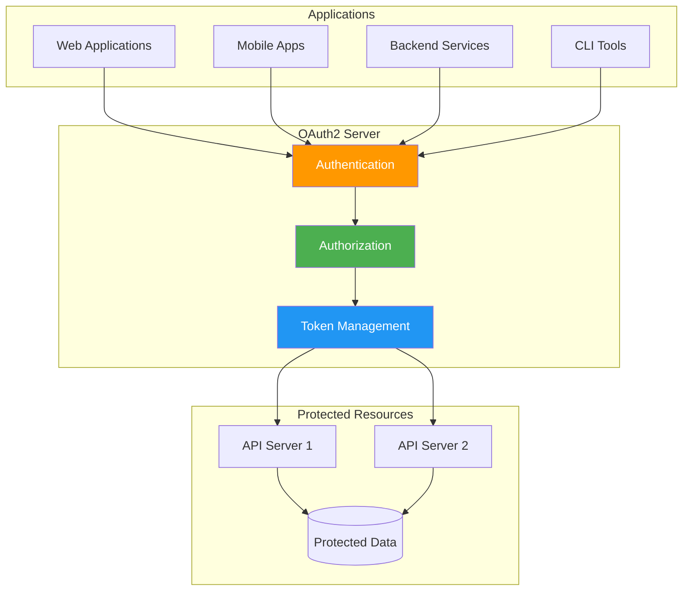
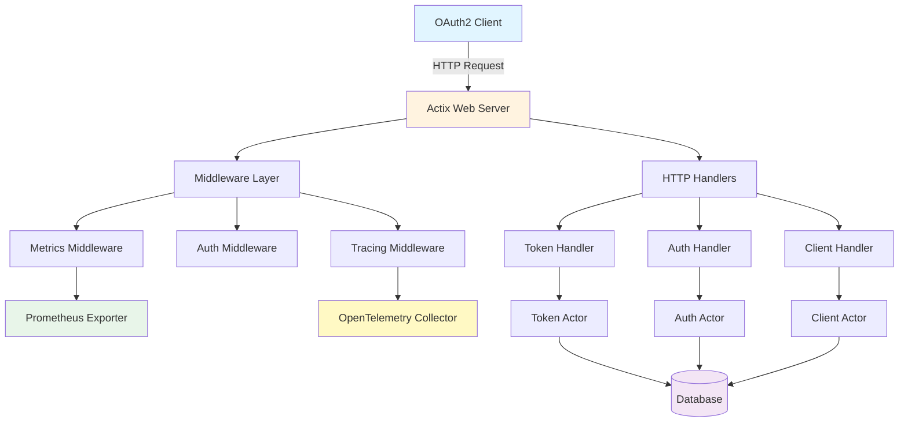
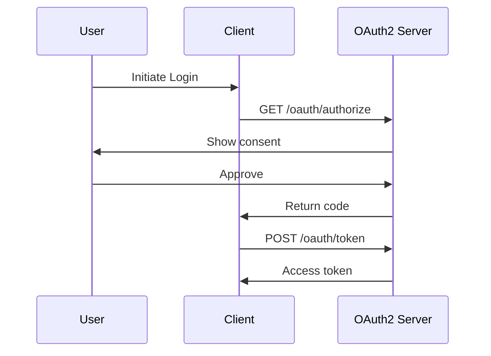
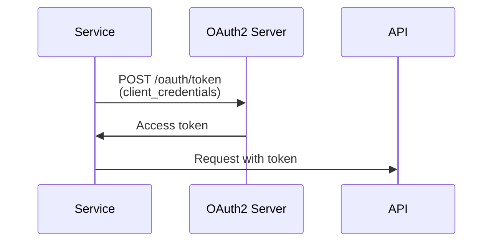
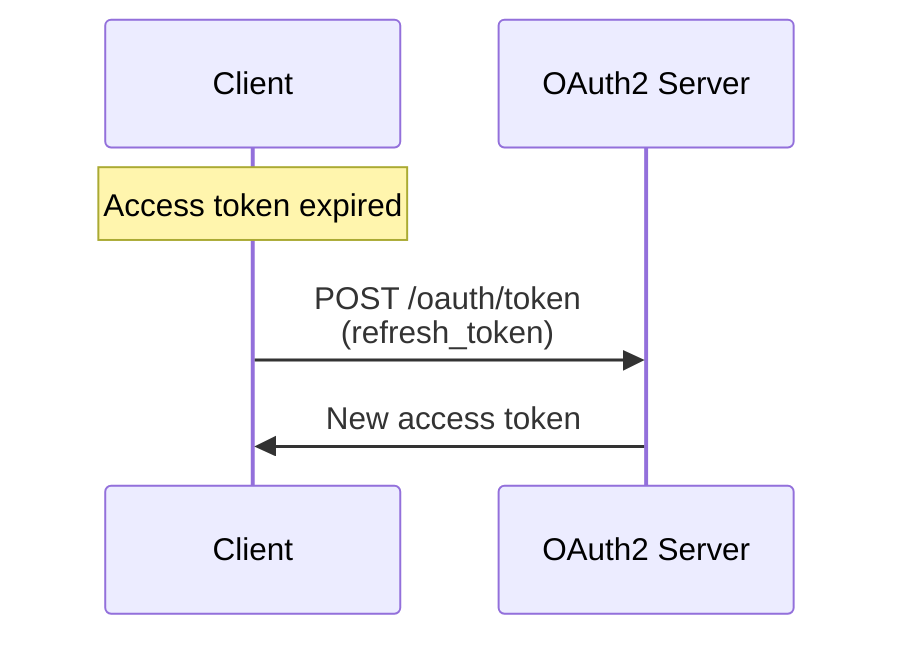
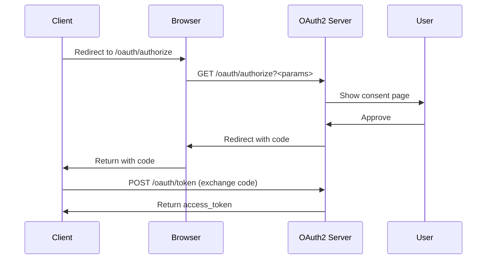
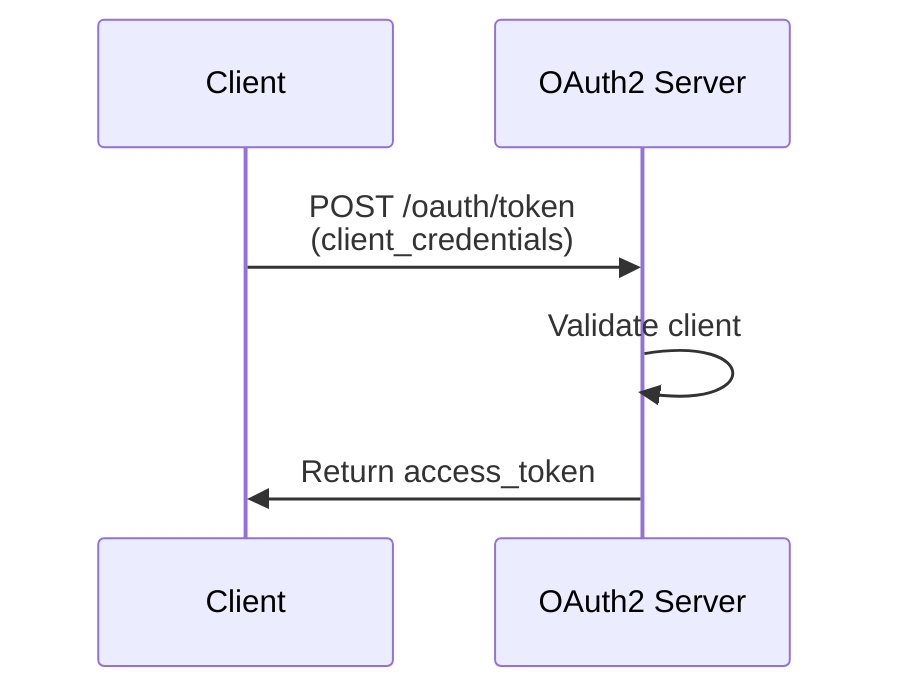

# Rust OAuth2 Server

Welcome to the comprehensive documentation for the Rust OAuth2 Server - a production-ready, high-performance OAuth2 authorization server built with Rust and Actix-web.

## 🌟 What is Rust OAuth2 Server?

The Rust OAuth2 Server is a complete OAuth2 implementation designed for modern cloud-native applications. It combines Rust's safety guarantees with the actor model for concurrent, fault-tolerant authentication and authorization services.



## 🚀 Features

- ✅ Complete OAuth2 implementation with all standard flows
- 🎭 Actor model for concurrent request handling
- 🔒 Type-safe Rust implementation
- 📊 Prometheus metrics and OpenTelemetry tracing
- 📚 OpenAPI documentation with Swagger UI
- 🎨 Admin control panel
- 🗄️ Flyway database migrations
- 🐳 Docker and Kubernetes ready

## Architecture Overview



## OAuth2 Flows Supported

### 1. Authorization Code Flow (with PKCE)

The most secure flow for web and mobile applications:



**When to use:** Web applications, mobile apps, SPAs

[Learn more →](flows/authorization-code.md)

### 2. Client Credentials Flow

For service-to-service authentication:



**When to use:** Microservices, backend services, APIs

[Learn more →](flows/client-credentials.md)

### 3. Refresh Token Flow

Obtain new access tokens without re-authentication:



**When to use:** Extending user sessions, mobile apps

[Learn more →](flows/refresh-token.md)

### 4. Password Grant Flow

!!! warning "Not Recommended"
    Only use for highly trusted, first-party applications.

[Learn more →](flows/password.md)

## Quick Start

### 1. Install and Setup

```bash
# Clone the repository
git clone https://github.com/ianlintner/rust_oauth2.git
cd rust_oauth2

# Run database migrations
./scripts/migrate.sh

# Start the server
cargo run
```

### 2. Register Your First Client

```bash
curl -X POST http://localhost:8080/clients/register \
  -H "Content-Type: application/json" \
  -d '{
    "client_name": "My App",
    "redirect_uris": ["http://localhost:3000/callback"],
    "grant_types": ["authorization_code"],
    "scope": "read write"
  }'
```

### 3. Get Access Token

```bash
# Client credentials flow example
curl -X POST http://localhost:8080/oauth/token \
  -d "grant_type=client_credentials" \
  -d "client_id=YOUR_CLIENT_ID" \
  -d "client_secret=YOUR_CLIENT_SECRET"
```

## Documentation Structure

### Getting Started

- **[Installation](getting-started/installation.md)** - Set up the OAuth2 server
- **[Quick Start](getting-started/quickstart.md)** - Your first OAuth2 flow
- **[Configuration](getting-started/configuration.md)** - Complete configuration guide
- **[Social Login Setup](getting-started/social-login-setup.md)** - Configure social providers

### Architecture

- **[Overview](architecture/overview.md)** - System architecture and design
- **[Actor Model](architecture/actors.md)** - Actor-based concurrency
- **[Database](architecture/database.md)** - Schema and data access patterns

### OAuth2 Flows

- **[Authorization Code](flows/authorization-code.md)** - Standard authorization flow
- **[Client Credentials](flows/client-credentials.md)** - Service-to-service auth
- **[Refresh Token](flows/refresh-token.md)** - Token refresh mechanism
- **[Password Grant](flows/password.md)** - Resource owner password credentials

### API Reference

- **[Endpoints](api/endpoints.md)** - Complete API documentation
- **[Authentication](api/authentication.md)** - Token usage and scopes
- **[Error Handling](api/errors.md)** - Error responses and codes

### Observability

- **[Metrics](observability/metrics.md)** - Prometheus metrics
- **[Tracing](observability/tracing.md)** - OpenTelemetry tracing
- **[Logging](observability/logging.md)** - Structured logging
- **[Health Checks](observability/health.md)** - Health and readiness endpoints

### Admin Panel

- **[Dashboard](admin/dashboard.md)** - Admin web interface
- **[Client Management](admin/clients.md)** - Managing OAuth2 clients
- **[Token Management](admin/tokens.md)** - Token administration

### Deployment

- **[Docker](deployment/docker.md)** - Container deployment
- **[Kubernetes](deployment/kubernetes.md)** - K8s manifests
- **[Production](deployment/production.md)** - Best practices and security

### Development

- **[Contributing](development/contributing.md)** - How to contribute
- **[Testing](development/testing.md)** - Testing guide
- **[CI/CD](development/cicd.md)** - Continuous integration

## Key Features

### 🔒 Security First

- PKCE support for public clients
- Secure token storage with hashing
- Scope-based authorization
- Token revocation support
- CSRF protection
- Rate limiting (planned)

### ⚡ High Performance

- Async I/O with Tokio
- Actor-based concurrency
- Connection pooling
- Efficient request handling
- Minimal memory footprint

### 📊 Observable

- Prometheus metrics
- OpenTelemetry tracing
- Structured JSON logging
- Health check endpoints
- Admin dashboard

### 🌐 Cloud Native

- Stateless design
- Docker container support
- Kubernetes ready
- Horizontal scaling
- Zero-downtime deployments

## Example Usage

### Register a Client

```bash
curl -X POST http://localhost:8080/clients/register \
  -H "Content-Type: application/json" \
  -d '{
    "client_name": "My Application",
    "redirect_uris": ["http://localhost:3000/callback"],
    "grant_types": ["authorization_code", "refresh_token"],
    "scope": "read write"
  }'
```

### Get Access Token

```bash
curl -X POST http://localhost:8080/oauth/token \
  -d "grant_type=client_credentials" \
  -d "client_id=YOUR_CLIENT_ID" \
  -d "client_secret=YOUR_CLIENT_SECRET"
```

### Use Access Token

```bash
curl http://your-api.com/protected/resource \
  -H "Authorization: Bearer YOUR_ACCESS_TOKEN"
```

## Monitoring

Access the admin dashboard at `http://localhost:8080/admin` to view:

- Active tokens and clients
- Request metrics and latency
- System health status
- Recent activity logs

View Prometheus metrics at `http://localhost:8080/metrics`

View Swagger UI at `http://localhost:8080/swagger-ui`

## Support and Community

- **Documentation**: You're reading it!
- **Issues**: [GitHub Issues](https://github.com/ianlintner/rust_oauth2/issues)
- **Discussions**: [GitHub Discussions](https://github.com/ianlintner/rust_oauth2/discussions)
- **Source Code**: [GitHub Repository](https://github.com/ianlintner/rust_oauth2)

## Next Steps

1. **[Install the server](getting-started/installation.md)** - Get up and running
2. **[Follow the quick start](getting-started/quickstart.md)** - Complete your first flow
3. **[Explore OAuth2 flows](flows/authorization-code.md)** - Understand the protocols
4. **[Configure for production](deployment/production.md)** - Deploy securely
5. **[Set up monitoring](observability/metrics.md)** - Track performance

## License

This project is dual-licensed under MIT OR Apache-2.0.

---

**Ready to get started?** Head over to the [Installation Guide](getting-started/installation.md)!


## OAuth2 Flows

The server supports all standard OAuth2 flows:

### Authorization Code Flow with PKCE



### Client Credentials Flow



## Quick Links

- [Installation Guide](getting-started/installation.md)
- [Quick Start](getting-started/quickstart.md)
- [API Reference](api/endpoints.md)
- [Admin Panel](admin/dashboard.md)
- [Metrics & Observability](observability/metrics.md)

## Example Usage

### Register a Client

```bash
curl -X POST http://localhost:8080/clients/register \
  -H "Content-Type: application/json" \
  -d '{
    "client_name": "My App",
    "redirect_uris": ["http://localhost:3000/callback"],
    "grant_types": ["authorization_code"],
    "scope": "read write"
  }'
```

### Get Access Token

```bash
curl -X POST http://localhost:8080/oauth/token \
  -d "grant_type=client_credentials" \
  -d "client_id=YOUR_CLIENT_ID" \
  -d "client_secret=YOUR_CLIENT_SECRET"
```

## Monitoring

Access the admin dashboard at `http://localhost:8080/admin` to view:

- Active tokens and clients
- Request metrics
- System health
- Recent activity

View Prometheus metrics at `http://localhost:8080/metrics`.

## Support

For issues, questions, or contributions, please visit our [GitHub repository](https://github.com/ianlintner/rust_oauth2).
