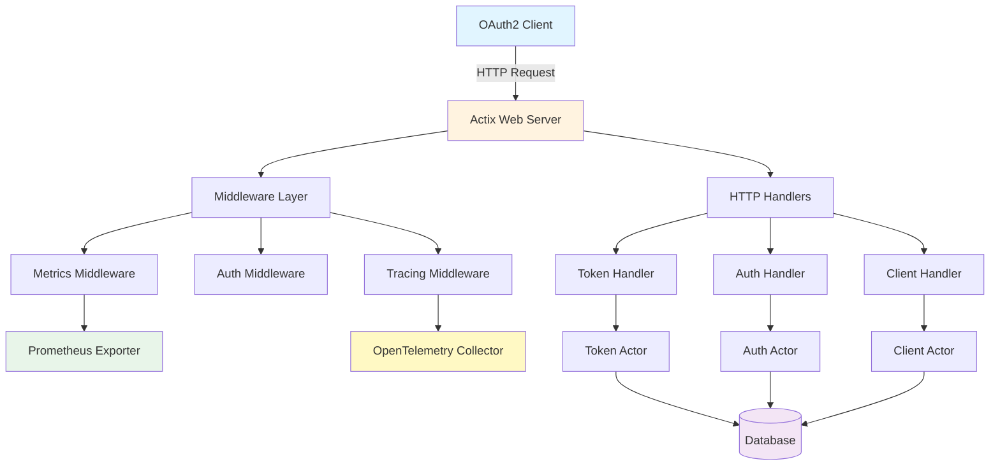
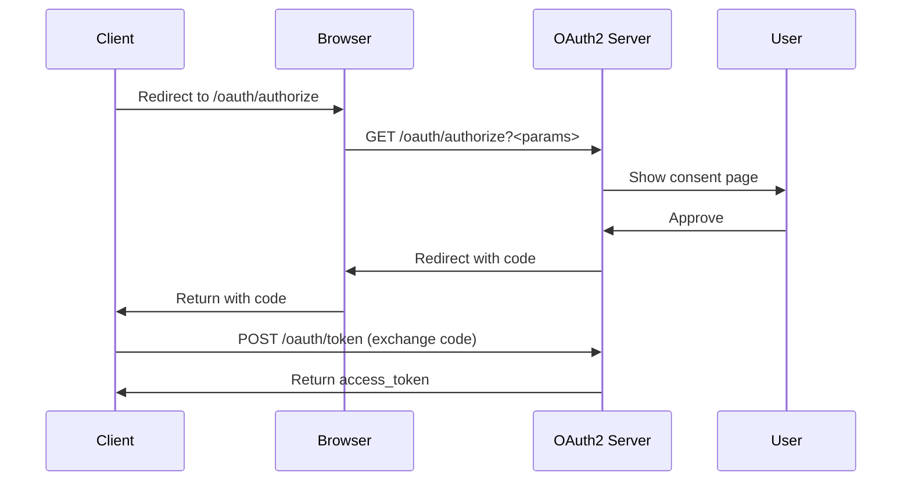
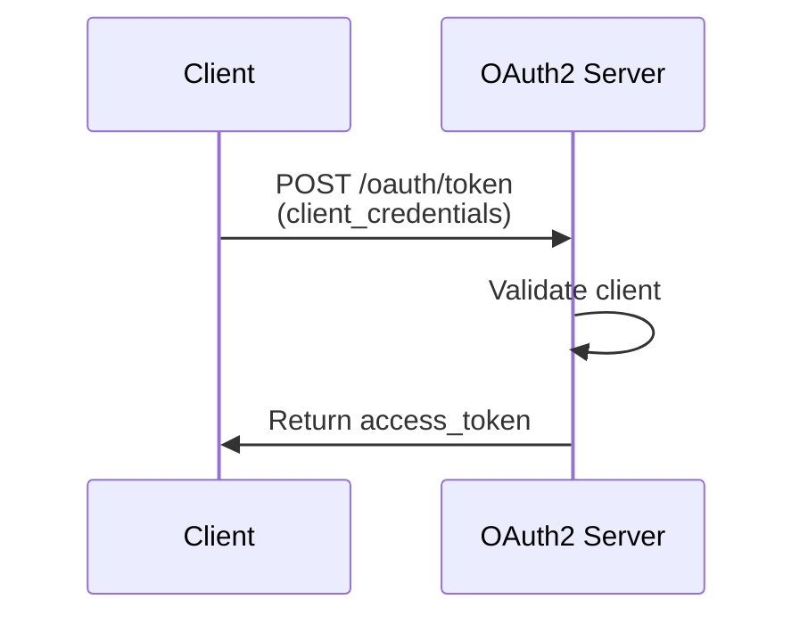

# Rust OAuth2 Server

Welcome to the documentation for the Rust OAuth2 Server - a complete, production-ready OAuth2 authorization server built with Rust and Actix-web.

## Features

- ✅ Complete OAuth2 implementation with all standard flows
- 🎭 Actor model for concurrent request handling
- 🔒 Type-safe Rust implementation
- 📊 Prometheus metrics and OpenTelemetry tracing
- 📚 OpenAPI documentation with Swagger UI
- 🎨 Admin control panel
- 🗄️ Flyway database migrations
- 🐳 Docker and Kubernetes ready

## Architecture Overview



## OAuth2 Flows

The server supports all standard OAuth2 flows:

### Authorization Code Flow with PKCE



### Client Credentials Flow



## Quick Links

- [Installation Guide](getting-started/installation.md)
- [Quick Start](getting-started/quickstart.md)
- [API Reference](api/endpoints.md)
- [Admin Panel](admin/dashboard.md)
- [Metrics & Observability](observability/metrics.md)

## Example Usage

### Register a Client

```bash
curl -X POST http://localhost:8080/clients/register \
  -H "Content-Type: application/json" \
  -d '{
    "client_name": "My App",
    "redirect_uris": ["http://localhost:3000/callback"],
    "grant_types": ["authorization_code"],
    "scope": "read write"
  }'
```

### Get Access Token

```bash
curl -X POST http://localhost:8080/oauth/token \
  -d "grant_type=client_credentials" \
  -d "client_id=YOUR_CLIENT_ID" \
  -d "client_secret=YOUR_CLIENT_SECRET"
```

## Monitoring

Access the admin dashboard at `http://localhost:8080/admin` to view:

- Active tokens and clients
- Request metrics
- System health
- Recent activity

View Prometheus metrics at `http://localhost:8080/metrics`.

## Support

For issues, questions, or contributions, please visit our [GitHub repository](https://github.com/ianlintner/rust_oauth2).
